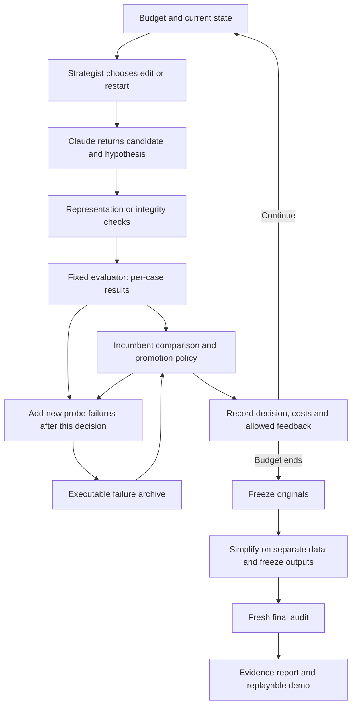

# Plan: one autoresearch loop with evidence attached

> **Archived plan.** Copied on 4 October 2026 from branch `plan/unified-autoresearch` (kept as local
> tag `archive/plan-unified-autoresearch`). It was not implemented as written; the project shipped
> `python -m autoresearch.loop` instead ([LOOP.md](../../autoresearch/LOOP.md)). Links were updated to
> the current repository layout.

**For review only.** Written 3 October 2026 against `ff559c5fc9c29691a4f6e621b1b42339738a57f0`, on branch `plan/unified-autoresearch`, in a separate worktree. No implementation, research runs, paid API calls, or cloud jobs are authorized by this document alone. Build target: **Sunday 4 October, 12:00 BST**; submission: **14:45 BST**, repository URL and video of at most four minutes.

## 1. Pitch and recommendation

**Swedish Science Mafia builds autoresearch that keeps the evidence for its decisions.** One loop chooses a research move, asks an LLM for a testable candidate, evaluates it with a fixed evaluator, replays executable failures before promotion, and feeds the measured outcome into the next proposal. At the end it audits the frozen result on fresh data and tries to turn it into a short rule, explicitly distinguishing faithful simplification from repair and rediscovery. Every result carries its ancestry, counterexamples, promotion decision, token usage, evaluator work and audit result. Ship this first for the existing bounded bin-packing representation; add the existing circle-packing code adapter only after that loop works. The contribution is an inspectable connection between proposal, falsification, promotion and explanation, demonstrated with real model calls. It is not a claim to have invented these components or discovered a better packing algorithm.

**Recommended scope:** option 1 below, about **8–10 focused engineering hours**, with a **1.5–2-hour circle-packing extension** if the core is complete early. Retain strict promotion as the default; run `validated_budget` as an explicit comparison. Retain Strategist's move interface and simple patience policy; defer its adaptive policy and crossover. Reuse triage's model transport and logs, but omit Jev, model tiers and refinement cascades. Do not make OR-Library/Weibull or a record-breaking result a condition for shipping.

The performance ceiling of this choice is real: the 12-feature space may just recover best-fit. We accept that limitation to close the largest evidential gap—an autonomous API-driven run with measured cost—while retaining a viable second demonstration with more headroom. The brief explicitly values demonstrated research mechanisms as well as benchmark gains; actual improvement remains preferable and must be reported if obtained.

## 2. Evidence that determines the design

The [experiment review](../papers/review/Swedish_Science_Mafia_Experiment_Review.pdf) is the primary evidence base. Read with the project hub, track brief, component READMEs and implementations. Its historical comments about uncommitted files describe the reviewed snapshot; this plan uses the consolidated commit above.

| Finding | Design consequence |
|---|---|
| V2 replay reduced excess bins from 0.023000 to 0.000725 versus random replay; no fresh-audit win over best-fit (review p. 2). | Keep executable failures and a fixed evaluator. Describe the evidence as reduced regression in bounded synthetic search. |
| V3 beat score-only promotion; advantage over a random gate was inconclusive (p. 4). | Retain score-only and random-input controls. Do not claim archive selection is already superior to random screening. |
| V4 validated-budget final excess was 0.007453125 versus strict's 0.007390625; their difference interval crossed zero. Plain relaxation worsened final quality (p. 5). | `validated_budget` means “uses validation,” not “validated as superior.” Keep strict as default and the validation-backed rule as a comparison. Drop unvalidated relaxation. |
| Only 16 proposals were labelled beneficial in the V4 diagnostic; validated-budget still allowed 271 of 599 empirically harmful proposals (p. 5). | This is a finite-data filter, not a safety guarantee or a statistically certified promotion rule. |
| Simplify faithfully reduced the selected winner to best-fit, but 21 of the 35 best-fit reductions repaired inferior candidates (pp. 6–7). | Add a two-sided explanation mode, keep originals, and independently confirm both versions. |
| Strategist had selective benefits, strong patience competitors, proxy costs and poor short-window switching results (pp. 8–10). | Reuse its scheduling seam and simple policy, not a claim of generally useful adaptive timing. Twelve LLM calls cannot meaningfully train its many contexts. |
| Triage has no saved comparative run; prior Codex hypotheses were conversation-guided, not autonomous API experiments (pp. 3, 11). | Prioritize the first complete live loop over another synthetic study or additional infrastructure. |

## 3. Ranked alternatives

Estimates include integration, a small approved live run, focused validation and a reviewable report; they are engineering estimates, not measured runtimes. Each row is an alternative total, not additive. Judging effects are expected opportunities, not promised scores.

| Rank / option | Effort | Delivery risk | Novelty | Performance | Interpretability / ease of use | Research efficiency |
|---|---:|---|---|---|---|---|
| **1. Evidence loop: bounded packing first; circle adapter if time** | **8–10 h core; 10–12 h with extension** | Low–medium; live provider path remains untested | Medium: failures, decisions and explanations become one executable research record | Modest in bounded space; circle extension can show improvement from its seed | High: exact formulas, witnesses, one CLI, replayable records | High visibility of real tokens and evaluator work; savings remain unproven |
| **2. Circle-first lean code search**: single Claude model, fixed schedule, existing integrity gate | **5–7 h** | Medium; numerical validity and slow candidates | Low–medium: mostly an existing code-search loop plus better provenance | Better chance of a visible gain over the initial construction; low confidence of approaching the reference | Medium: good geometry demo; no existing formula simplifier or distributional failure archive | Actual spend measurable; fewer components, but solver CPU may dominate |
| **3. Richer online bin-packing code search on FunSearch-style data** | **12–16 h** | High for noon; new evaluator, dataset contract and code reduction | Medium–high: evidence loop in a more expressive search space | Best plausible route here to beating best-fit, with no guarantee | Medium: code and per-bin behavior harder to simplify; better external benchmark relevance | Must measure item steps and wall time; long instances can dominate |
| **4. Full candidate stack**: Jev tiers + adaptive Strategist + bounded-loss promotion + both new benchmarks + generic Simplify | **20–30 h** | Very high | Many mechanisms, but difficult to isolate the new contribution | Unknown; interactions could erase gains | Low for the deadline: several abstractions and conflicting selection rules | Ranking, tiering and adaptation add costs before any saving is established |

Option 2 is the fallback if structured packing integration stalls, not a second independent framework. Option 3 is the preferred next research project after the hackathon. Option 4 should be dropped from this submission.

## 4. Architecture and concrete integration work

The proposed candidate has the order wrong: **choose the move before asking the model to implement it**. Triage allocates models; Strategist allocates move types. Neither should independently decide which program becomes the winner.

There is one orchestrator and one incumbent authority. Integrity answers “is the candidate valid?” Promotion answers “should this valid candidate replace the incumbent?” The final audit answers a third question: “what held up outside selection?”

### Module responsibilities

| Existing piece | Keep / adapt | New glue and limits |
|---|---|---|
| `autoresearch/triage.py` | Reuse event vocabulary, candidate artifacts, feedback/history and report conventions. | Add `autoresearch/evidence_loop.py`; do not nest the two existing `Run` classes or keep triage's independent promotion/refinement path. One candidate at a time initially. |
| `falsify/anthropic_propose.py` | Use its bounded structured proposal for the packing backend: 12 finite weights, hypothesis and falsification. | Wrap with request-level budget reservation, complete usage logging and move-specific prompts. Record usage before parsing/validation so malformed output still counts. No model-written Python execution in this backend. |
| `autoresearch/claude.py` | Reuse transport and parsing for the optional code backend. | Explicitly choose one model; disable automatic refinement and fallback for the pilot. Preserve raw provider usage, including cache fields, instead of just derived cost. Unknown model prices must fail closed, not inherit an unrelated default price. |
| `strategist/problems.py` and `controller.py` | Preserve `random/score/edit/rewrite/crossover` semantics and `Patience`. | A bridge supplies LLM-backed proposals and cached evaluations. Start with `Patience(4)` over edit/restart: a disclosed engineering default, not the previously validated T=64. Count failed/invalid attempts as stalls. Crossover and `Adaptive` remain off. |
| `strategist/search.py` | Reuse concepts of working line and retained leader. | Its `Run.step()` hard-codes acceptance and charges a static cost table; it cannot simply be plugged in. The new orchestrator owns promotion and measured costs. Restarts open a working line without overwriting the deployed leader. |
| `falsify/core.py` | Existing capacity-100 evaluator, suites, traces, first-fit and best-fit references. | New packing adapter returns per-case counts, baseline deltas and execution/item-step counts. Use 12 features so the existing proposer and simplifier agree. Applying the V4 decision rule to these LLM proposals is a new application, not reproduction of its 20-feature experiment. |
| `falsify/soft_gates.py::gate_decision` | Reuse the pure decision function and V4's corrected archive deduplication logic. | Supply per-instance candidate-minus-best-fit deltas. Incumbent eligibility happens outside this function. Keep gate settings and loss units explicit. |
| `autoresearch/gate.py` and `sandbox.py` | Optional code backend: static checks, subprocess runner, construction verification, private integrity details. | Expose complete per-case validity. Current `correct.json` requires only **any** public instance to be valid; the new promotion adapter requires **all required** instances valid, finite scores and no timeout. Keep private data out of feedback. This remains honest-loop isolation, not hardened security. |
| `falsify/simplify.py` | Formula rendering, term deletion/rounding, ablations and witness shrinking. | Add an explicit two-sided mode for new runs, with separate simplification and confirmation suites. Do not invoke its CLI defaults: those use old fixed seeds and an evidence-folder output. Generic Python or geometry simplification is unsupported. |

### The shared contract

Add small `Candidate`, `Evaluation` and `Usage` records rather than pretending all existing APIs are interchangeable:

- `Candidate`: content hash, representation (`weights12` or `python`), payload, parent IDs, move, hypothesis and model provenance.
- `Evaluation`: **lower-is-better objective**, raw per-case scores, validity, reference deltas, split IDs, executable failures, evaluator count, item steps and elapsed time. Packing objective is mean bin count; circle objective is negative sum of radii. Display values retain natural units. Never compare the two benchmarks' numerical scores.
- `Usage`: requested/served model, request ID, input/output/cache tokens, price-table version, derived USD, duration and outcome, including failed or rejected attempts.
- `ProblemAdapter`: seed, propose/move prompt, evaluate on a specified split, feedback filter, reference and optional simplification. `score(candidate)` returns cached results, avoiding accidental duplicate API calls or evaluations through Strategist's five-method interface.

Preserve the four-file `problems/` contract for existing code problems through a `CodeProblemAdapter`. Add an explicitly documented optional host-side `adapter.py` plus `initial.json` for structured problems such as `problems/bin_packing/`; `problem.md` remains the model-facing task. The fixed host packer sees the stream; the model candidate supplies weights only. Passing the full item list to an unrestricted `solve(items)` would silently change the online task. A future code packing adapter must invoke a priority function at each arrival with only the current item, current capacities and permitted past state.

The future adaptive integration needs more than replacing `COSTS`: `Adaptive.estimates()` currently uses `self.costs[op]` even though `update()` stores observed cost. It also has cost-scaled decay/prior parameters. Leave that integration out; log measured costs now and redesign/calibrate its yield estimates before claiming real-token adaptive control.

### Promotion and memory

For packing, define `d_i = candidate_bins_i - best_fit_bins_i` (positive is worse). A candidate is eligible only if all evaluations are valid and its fixed-suite mean is no worse than the incumbent's. Break score ties consistently by fewer nonzero terms, then content hash; do not count identical candidates as discoveries.

Default strict gate: every sampled stress delta must be nonpositive. Comparison `validated_budget`: at most two positive stress deltas, maximum one bin each, total positive loss at most `1 + max(0, -sum(validation_deltas))`, and mean validation excess at most zero. Neutral validation therefore still permits one one-bin loss. These absolute bins cannot be transplanted into circle-radius units.

Keep at most 64 unique archive cases, initially populated with fresh development probes. Freeze the sampled archive before each proposal evaluation; add new probe failures afterwards, keeping the maximum observed regression per case within and across batches. Store input, family, baseline count, candidate hash and generation. Re-evaluate sampled cases against the current candidate: historical severity is a sampling priority, not its current loss. Shrink a development failure only within a separately counted budget. Do not feed final-audit failures back into this run. A sampled gate is not exhaustive, and the MVP adds no automatic rollback claim.

Give the next prompt the current formula, recent outcomes, and up to two compact executable development witnesses. Do not label an idea universally impossible because one implementation failed. Bound history and archive context so costs remain predictable.

**What is genuinely new here:** the shared loop, typed boundary, actual-cost ledger and per-candidate evidence record joining autonomous proposals to gate decisions and checked explanations. Executable replay, scheduling, triage, ablation and code evolution are existing ideas. Whether this combination makes LLM research better is an open empirical question.

## 5. Benchmarks: what ships and what waits

**Primary: existing synthetic online bin packing, 80 integer items, capacity 100.** This is the only setting where the proposed interfaces align with little new scientific machinery. Start the deployed incumbent at best-fit. Display first-fit as a weak reference and best-fit as the strong control. Do not run another large mutation study, or sell matching best-fit as discovery. A run that rejects every novel proposal still demonstrates the integrated mechanism, but must report zero improvement.

**Timed extension: circle packing, n=26.** Run the same orchestrator with the code backend and existing `initial.py`. Use valid score improvement as its promotion policy; show the bin-specific archive gate and simplifier as unsupported capabilities. Reuse the same move scheduler, usage ledger, provenance and reporting. Add explicit candidate RNG seeding and repeat evaluation under a small frozen set of development seeds; after selection repeat under fresh seeds with equal solver time limits. A deterministic construction instead needs independent geometric verification, not a fabricated train/test distribution. The current verifier has `PUBLIC=[{"n":26}]`, **`HIDDEN=[]`**, and a 300-second per-instance limit. Do not describe it as held-out generalization. Reduce the pilot execution cap to 30 seconds before running, recording that protocol change, and strictly recheck the final construction even if it does not exceed the stored reference. Report seed-to-final radius sum and gap to the repository's **reference construction** (2.6359830849176076); do not call that an independently established current world record. Export coordinates and a simple drawing. No generic Simplify claim.

**Defer OR-Library/Weibull to option 3.** FunSearch's primary paper reports improvements on these benchmarks with code that scores an array of remaining capacities, using an online packer and an L2 lower-bound metric. That supports the direction, not a prediction for our system ([paper](https://www.nature.com/articles/s41586-023-06924-6)). Its [official repository](https://github.com/google-deepmind/funsearch) supplies the evaluation suite and discovered heuristics. A comparable extension must preserve capacities and arrival order, match the published Weibull generator and size regimes, freeze dataset versions/splits, use generated training instances and untouched final OR instances, and report best-fit, first-fit and a published FunSearch heuristic on our exact evaluator. The current C++ packer, features and `identity(bytes(items))` assume integer items up to 100. Rescaling and rounding other capacities into that format is not faithful replication. Longer streams also require item-step and runtime accounting, not just case counts. This is new benchmark engineering, not “add two families.”

## 6. The first live run, after approval

Pre-register the following in a **new `runs/<unique-id>/protocol.md`**, outside `experiments/`. Commit the implementation/configuration before paid execution. Do not read, copy or print secrets into logs; use the worktree-local ignored `.env` only.

1. **Offline integration checks.** Use recorded/mock responses to verify score direction, invalid-candidate rejection, budget reservation, all-valid promotion, archive deduplication and audit isolation. Check the compiler/evaluator and existing relevant tests. These are software checks, not new scientific results. Ensure the initial program is saved even if no candidate improves it.
2. **One live packing pilot, at most 12 requests**, including any billed retries or diagnostic calls. One structured proposal per call; `Patience(4)` chooses edit/restart before prompting. Use `claude-sonnet-4-6` explicitly if available to the team's account; its structured adapter is already present. If unavailable, stop before substituting a model and revise the recorded configuration within the approved spend ceiling. No Jev, model tiers, cloud jobs or concurrent call batches.
3. **Bound each request** to at most 6,000 counted input tokens including system/schema and 1,024 output tokens; retain the adapter's 12,000-character user-prompt bound too. Count/reserve before dispatch using the provider's supported token-count mechanism. Disable untracked retries and caching for the pilot. A billed attempt is charged even if parsing, schema validation or evaluation fails; unresolved usage after a network failure reserves its maximum cost and is labelled unresolved, never zero.
4. **Selection data:** 24 fixed cases from the five existing training families; 16 sampled archive cases; 16 independently sampled random development cases for the random-gate control; 64 fresh validation cases and eight fresh discovery probes per step. All of these are development data. Their generation streams are distinct from old studies and the final audit. Cache best-fit reference results and label physical versus logically charged evaluations.
5. **Compare gates on the same recorded proposal stream:** score-only, random-input strict, archive strict (the actual feedback/deployment path), and archive validated-budget. All arms receive identical candidates and the same full evaluation table, including results they ignore; each maintains its own incumbent with the same tie rule. This is an inexpensive integration diagnostic on new LLM proposals. Because strict-path feedback shaped those proposals, it is **not** a causal comparison of four autonomous search systems. Do not rerun the known-worse plain loss-budget treatment.
6. **Close the loop:** automatically include the previous measured outcome and development witnesses in subsequent requests. Log duplicates, refusals, invalid outputs, no-promotion runs and every paid attempt. No human edits to a proposal within the recorded run. If no failure or improvement occurs, report that fact instead of inserting one for the video.
7. **Freeze and explain:** freeze the final originals from the four gate paths. Simplify each distinct original on a new 1,000-case simplification suite, with a 150,000-packing-execution cap per original. Explanation mode requires absolute mean change <=0.002 relative to the original at every accepted step. Changes exceeding that tolerance in the improving direction are repairs, retained separately rather than called faithful explanations. Two-sided mean tolerance still does not establish equal behavior: retain per-case count and placement disagreements.
8. **Fresh audit:** after all selection and simplification finish, generate one new 1,600-case suite balanced across the eight families. Evaluate every frozen original and simplification, best-fit and first-fit on identical cases; never choose the report's winner using this audit. Report mean excess, per-family values, wins/ties/losses, worst observed loss and paired case-bootstrap intervals stratified by family. The audit estimates performance on this specified family mixture; a single search trajectory supplies no across-run uncertainty. If a simplification fails confirmation, keep the original and label the failure. Any subsequent revision requires another fresh audit.
9. **Measured output:** emit `usage.jsonl`, proposal responses, candidate hashes, split manifests, gate tables, raw audit counts, `summary.json` and a readable `report.md`/HTML. The report must contain actual input/output tokens, derived USD, elapsed time, evaluator calls and item steps. Recompute totals from raw events and match provider usage where available. The present plan contains no measured API cost because no call has been made.

**Proposed spending ceiling: USD 5 total, only if approved with this plan.** Reserve USD 2 for the packing pilot and failures, USD 2 for the optional circle run, and USD 1 contingency; never exceed the total. At the currently documented Sonnet 4.6 standard rates ($3/M input, $15/M output), twelve calls at the stated maxima would be **$0.40032** before retries or other billable usage. That is a planning ceiling calculation, not an observed bill. Prices and account access must be checked at execution ([official pricing](https://platform.claude.com/docs/en/about-claude/pricing), consulted 3 October). The cost formula is `(input_tokens × input_rate + output_tokens × output_rate)/1,000,000`, with separately priced cache categories if enabled in a later protocol. Stop before a call whose reserved maximum would exceed either its allocation or the overall cap.

If the extension is reached, run **at most four single-model circle code proposals**, one call each, at most 6,000 input / 4,096 output tokens each, within its reservation. Use the same seed, time-limit and evaluation protocol for every candidate, and count all repetitions. This demonstrates code generation and improvement over the supplied initial solver if observed. It does not test the bin-packing gate or Simplify on geometry.

## 7. Claims, controls and what a small run cannot establish

| Potential statement after the run | Evidence required / honest wording |
|---|---|
| “Our autonomous loop ran with a real LLM.” | Successive provider request records, automatic outcome feedback, candidate artifacts, evaluations and actual usage totals. A single isolated proposal is insufficient. |
| “This final packing rule beat best-fit on this fresh suite.” | Preselected final rule, untouched audit, paired counts and uncertainty. If interval overlaps zero, call the estimated difference inconclusive. Even a clean win is limited to this suite/distribution, not general algorithm superiority. |
| “The gate blocked this regression.” | The actual candidate, failure input, baseline packing and decision. A shadow comparison may show different outcomes for this stream; it cannot show general superiority or isolated LLM-memory benefit. |
| “The rule simplifies faithfully on measured data.” | Two-sided selection check plus independent confirmation, with per-case and placement disagreement rates. Exact best-fit identification is justified for recognized monotone one-term rules; universal equivalence of arbitrary formulas is not. |
| “The framework used X tokens, $Y and Z evaluator work.” | Complete ledger including proposal generation, invalid attempts, any retries, validation, shrinking, simplification and audit. Break search costs out from final reporting costs. Derived list-price cost and actual billed cost must be distinguished if discounts apply. |
| “Circle packing improved from the supplied seed.” | Frozen solver limits/seeds, validated starting and final scores, saved coordinates and strict recheck. It is not necessarily a new record, a novel algorithm or an out-of-distribution gain. |

**Controls in the minimum deliverable:** best-fit and first-fit on the same fresh audit; identical-stream score-only and random-input gates alongside strict and validated-budget; original versus simplified output; complete real-cost accounting. The initial packing incumbent is already the strong baseline, so first-fit is not used to inflate the claimed improvement.

**Controls needed for stronger future claims, excluded from the noon commitment:**

- To claim executable memory improves LLM search: independent repeated closed-loop runs with no memory, token-matched prose memory and executable memory; same model, scheduler, promotion rule, prompt/output ceilings and evaluator budgets. Predeclare primary endpoint and fresh audits. Matching maximum budgets does not imply identical realized spend: report both and compare at common spend checkpoints. Seeds identify harness/data randomness; they do not guarantee deterministic model responses.
- To claim adaptive scheduling helps: compare edits-only, a patience threshold selected on separate development runs, fixed mix and adaptive under actual token/dollar and evaluation caps. A timing-shuffled action multiset is a useful additional control, but differing LLM response lengths still require measured-cost accounting. Do not reuse the synthetic proxy-cost results as evidence for this claim.
- To claim better research efficiency: compare audited quality at matched resource budgets across enough independent searches. Same-candidate gate replay cannot establish token savings, and fewer model calls with worse quality is not sufficient.
- To claim competitive benchmark performance: evaluate the published reference heuristics and our frozen candidate under an identical online interface, data and runtime allowance. Report dataset-specific outcomes rather than pooling unrelated objectives.

No null result will be described as equivalence. No final-audit failure will be turned into a new training case while retaining the “fresh audit” label.

## 8. Delivery schedule and cut lines

At drafting time it is approximately Saturday 19:15 BST, leaving under 17 hours to noon. This schedule assumes approval around 19:30; later approval cuts extensions first. It assumes one implementation owner and does not depend on simultaneous edits to shared files.

| BST window | Work / checkpoint | Cut if missed |
|---|---|---|
| Sat 19:30–21:30 | Shared records, structured packing adapter, one orchestrator, request reservations, offline end-to-end replay. | If no complete offline loop, use option 2's lean code path; drop adaptive and all benchmark expansion regardless. |
| Sat 21:30–23:30 | Gate/archive integration, focused checks, launch the approved 12-call live pilot early enough to expose provider problems. | Require two automatically connected live proposals by 23:30. If provider access is blocked, finish replay/reporting and disclose that the live criterion remains unmet; never substitute mock calls as real. |
| Sun 07:00–09:00 | Finish the bounded pilot, simplify frozen originals, generate the final audit, reconcile costs and write the report. | Core evidence package is the priority. No new research mechanism after 09:00. |
| Sun 09:00–10:30 | Circle extension only if the core has passed; otherwise fix packaging and reproducibility. | At 10:30 stop all benchmark expansion and freeze code/candidates. |
| Sun 10:30–11:30 | Clean-environment install/replay check, one-command README, concise architecture diagram and record the demo. | Prefer reliable saved replay with an explicit live-run provenance label over depending on network latency during the video. |
| Sun 11:30–12:00 | Final source/data/claim review; leave a reproducible submission candidate. | No further experiments. Keep 12:00–14:45 for team review and submission logistics. |

Core acceptance: one command starts a budgeted loop; a saved trace proves real automatic model feedback; promotion decisions can be replayed; fresh audit and explanation results are clearly separated; actual costs reconcile; only public/development feedback reached the model. Circle success is a bonus, not a prerequisite for calling the core complete.

Planned implementation surfaces are `autoresearch/evidence_loop.py`, small adapter/record/budget modules, `problems/bin_packing/`, explicit-mode changes to `falsify/simplify.py`, and focused integration tests. Existing experiment files stay untouched. Put new run evidence under `runs/` with a unique ID and refuse an existing output directory; do not silently lose the submission artifacts under the currently ignored `results/` directory. Keep raw candidate responses and source/config hashes, excluding credentials. Existing evidence reports can be linked, not regenerated into their old paths.

The four-minute video should show the loop and contribution (~40 s), a real logged proposal and executable failure/promotion decision (~75 s), final audit and simplification or circle result (~65 s), measured cost/reproduction command (~35 s), and limitations/next experiment (~25 s). Use only events that actually occurred; historical examples must be visibly labelled historical.

## 9. What not to do

- Do not rerun the large V1–V4 or Strategist studies, repeat known failed hand-crafted packing ideas unchanged, retune on their audits, or rewrite any `experiments/<name>/` folder. Use their conclusions as constraints.
- Do not use the word “validated” to imply the bounded-loss gate is proven better; do not rerun the unvalidated relaxation as a promising new arm.
- Do not promise that the fixed 12/20-feature spaces can express a FunSearch winner, or call an OR-Library rescaling a faithful benchmark implementation.
- Do not bolt Jev, three model tiers, crossover, adaptive switching and generic code simplification onto the critical path. Their interaction would be uninterpretable in one short run.
- Do not quietly put Simplify's repaired or newly selected output through the same already-inspected audit and present it as confirmation.
- Do not call a recovered best-fit rule novel, training improvement generalization, a reference construction a proven optimum, or subprocess isolation a hardened sandbox.
- Do not claim that merely adding token prices to Strategist's static proxy costs implements measured-cost adaptive control.
- Do not launch cloud/GPU work, paid calls or implementation before plan approval. Keep keys only in ignored `.env`, never in prompts, logs or tracked files.
- Do not push to `main`, merge the plan yourself, or send the submission. This handoff ends with the plan in its own branch for review.

## Source trail

Primary evidence: [review PDF](../papers/review/Swedish_Science_Mafia_Experiment_Review.pdf), [project hub](../../README.md), [track brief](../hackathon/track-1-brief.pdf), [Falsify](../../falsify/README.md), [Strategist](../../strategist/README.md), [triage](../../autoresearch/README.md), [problem contract](../../problems/README.md), [Simplify study](../../experiments/simplify-v1/EXPERIMENT.md).

Integration findings: [Problem interface](../../strategist/problems.py), [search acceptance/costs](../../strategist/search.py), [controller estimates](../../strategist/controller.py), [triage loop](../../autoresearch/triage.py), [integrity gate](../../autoresearch/gate.py), [bounded-loss decision](../../falsify/soft_gates.py), [simplifier](../../falsify/simplify.py), [structured model adapter](../../falsify/anthropic_propose.py), [circle verifier](../../problems/circle_packing/verify.py). External references above establish benchmark provenance and planning prices only; they do not add experimental evidence for this repository.
