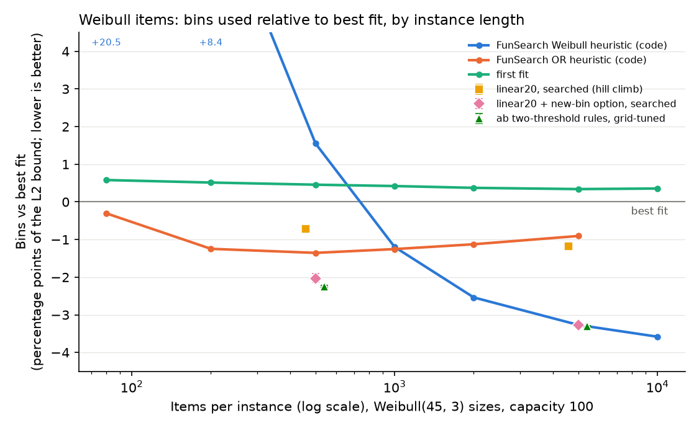

# bp-ceiling-v1 results: why nothing in Falsify beats best fit

## Question and answer

**Question.** Falsify's searches never beat best fit on fresh data. Is the limit the
representation (12 or 20 fixed linear features per open bin) or the instances (80 items from
Falsify's families)?

**Answer: mainly the instances, and second the representation's missing "open a new bin"
option. Code is not needed.**

- **80-item Falsify families: almost no headroom for online rules.** FunSearch's Weibull
  heuristic uses 14.974 percentage points (pp) of the L2 bound more than best fit (2,452 of
  2,500 audit instances lost). Its OR heuristic loses by 1.149 pp. Grid-tuned two-threshold
  rules (Herrmann & Pallez 2025) lose by 0.032 pp, and the searched 20-feature space loses by
  0.025 pp [0.017, 0.034]. The only interval below zero is the 20-feature space with a new-bin
  option, hill-climbed: -0.086 pp [-0.106, -0.062], or 0.035 bins per instance, 18 of 20
  seeds. It does not survive distribution shift: +2.95 pp [1.27, 5.03] on the shifted
  families. Offline, best fit is still 0.9-4.1% above the exact optimum at 80 items, so the
  slack exists but no online rule we tried captures it.
- **Weibull instances: the existing 20-feature space does have headroom.** Searched on
  Weibull, it beats best fit by 0.724 pp [0.709, 0.737] at 500 items and 1.182 pp
  [1.157, 1.204] at 5,000 items (20/20 seeds each, fresh audit).
- **The missing ingredient is the option to open a new bin while an open bin still fits.**
  The 20-feature packer never does this. FunSearch's Weibull heuristic does it for 39.9% of
  items at 5,000 items. Offering one unused bin as a candidate (one extra feature, 21 weights)
  takes linear search to -3.278 pp [-3.323, -3.225] at 5,000 items, level with FunSearch's
  code (-3.329 [-3.399, -3.260]) and the tuned ab rules (-3.310 [-3.322, -3.293]).
- **Length matters for code too.** FunSearch's Weibull heuristic is worse than best fit on
  Weibull items up to 500 items (+20.476 pp at 80, +1.553 at 500) and better from 1,000
  (-1.198) to 10,000 (-3.581). Positive control: on FunSearch's own Weibull 5k test data our
  evaluator gives exactly the published 3.98% (best fit), 4.23% (first fit) and 0.68%
  (FunSearch).

## Decision table

Delta = excess bins over the L2 lower bound (in percentage points of the bound) minus best
fit's. **Negative is better than best fit.** Searched arms: mean over 20 seeds with 95%
bootstrap interval over seeds; fixed heuristics: 95% bootstrap interval over audit instances.
"Headroom" means the interval lies entirely below zero (pre-registered rule).

| Regime | Linear 20 features, searched | Linear + new-bin option, searched | Code: FunSearch Weibull heuristic (fixed) | ab rules, grid-tuned |
|---|---:|---:|---:|---:|
| falsify80 (80 items, Falsify families) | +0.025 [+0.017, +0.034] | -0.086 [-0.106, -0.062] **headroom** | +14.974 [+14.692, +15.257] | +0.032 [+0.019, +0.049] |
| weibull500 | -0.724 [-0.737, -0.709] **headroom** | -2.027 [-2.138, -1.907] **headroom** | +1.720 [+1.581, +1.861] | -2.244 [-2.270, -2.216] **headroom** |
| weibull5k | -1.182 [-1.204, -1.157] **headroom** | -3.278 [-3.323, -3.225] **headroom** | -3.329 [-3.399, -3.260] **headroom** | -3.310 [-3.322, -3.293] **headroom** |

The falsify80 "headroom" cell is 0.035 bins per instance and reverses on the shifted families
(+2.95 pp [1.27, 5.03]); see the family table below.

What this means for where the team's LLM search should run:

| Question | Answer from this table |
|---|---|
| Is a weights regime worth running on Weibull? | Yes, but expect a ceiling: the 20-feature space tops out near -1.2 pp at 5k, a third of FunSearch's gain. With the new-bin feature it reaches FunSearch's level, so a weights regime is a cheap, strong baseline for any LLM code search. |
| Should LLM search run on 80-item Falsify families? | Not to beat best fit: no representation we tried, including FunSearch's code, gains more than 0.09 pp there, and the one small gain breaks under shift. Use them for robustness and regression checks instead. |
| Where can a code search show progress? | Weibull 5k (`problems/bin_packing_online`): best fit scores 0.962, FunSearch's heuristic 0.993. The bar to clear is the tuned two-threshold rule (-3.31 pp, about FunSearch level), which costs one minute of CPU. |

## What we did

**Built**

| File | Role |
|---|---|
| `problems/bin_packing_online/` | Reusable problem adapter (four-file contract): FunSearch's `priority(item, bins)` interface, Weibull 5k instances, score = L2 bound / bins used. Commits `ffd72cf` (adapter) and `6092cae` (generator truncation; interface unchanged). |
| `autoresearch/sandbox.py: run_online`, `autoresearch/gate.py` | Optional online protocol: the parent reveals one item at a time over a private pipe and sends item k+1 only after reading decision k, so the candidate never holds future items. Backward compatible (`gate_compat_check.py`: all four existing problems score identically to `main`). |
| `falsify/longpack.cpp`, `falsify/longpack.py` | Long-instance evaluator: best/first/worst fit, the 20 contextual features (optionally plus an unused-bin candidate), Herrmann & Pallez ab rules, FunSearch's evaluator semantics for Python `priority` functions, Weibull generator, L1/L2 bounds. |
| `falsify/funsearch_heuristics.py` | FunSearch's OR and Weibull heuristics verbatim (notebook commit `cc53f27`, Apache-2.0) and the ab rules transcribed from the paper. |
| `falsify/ceiling.py` | Experiment CLI: `search`, `tune-ab`, `audit`, `sweep`, `headroom` (`--help`). |
| `falsify/ceiling_modal.py` | Modal fan-out (app `ssm-bp-ceiling`), prices the worst case before submitting and refuses above the cap. |
| `falsify/optimum.py` | Exact bin-packing ILP (HiGHS) for small instances. |
| `tests/test_bin_packing_online.py`, `tests/test_longpack.py`, `tests/test_ceiling.py` | 22 tests: no-lookahead protocol, verifier, L2 bound, agreement with `pack_contextual`, independent best/first fit, FunSearch's skeleton, the published means, matched budgets, ILP vs brute force. |

**Setup** (details in [PROTOCOL.md](PROTOCOL.md), written before the confirmatory runs)

- Regimes, matched at 20,000 item steps per candidate evaluation: `falsify80` (250 x 80 items,
  five training families), `weibull500` (40 x 500), `weibull5k` (4 x 5,000). Weibull(scale 45,
  shape 3) sizes truncated to 1..100, capacity 100.
- Representations: `linear20` (the existing contextual feature space, open bins only),
  `linear21` (plus one unused bin as a candidate with a "new bin" feature), FunSearch's code
  heuristics (fixed), and, added after the searches, grid-tuned ab rules.
- Search: hill climbing with the existing gated_search proposal stream (primary) and CMA-ES
  (secondary), 8,000 candidate evaluations per seed, 20 seeds per cell; ab rules: 1,560-point
  grid per seed on the same training sets.
- Audit: 2,500 + 1,500 shifted (falsify80), 400 (weibull500) and 40 (weibull5k) instances from
  namespace `bp-ceiling-v1/audit`, generated only after all 300 searches finished.

**Work log**

1. Cloned FunSearch (commit `cc53f27`) and its Supplementary Information. Confirmed capacity
   100 and Weibull(45, 3) clipped at 100. The SI says sizes were *rounded*; the released test
   items fit *truncation*: mean 39.75 against 40.18 expected with rounding (z = -4.7) and
   39.68 with truncation; chi-square p = 0.48 for truncation, 0.048 for rounding
   (`generator_check.json`). We truncate.
2. Found that FunSearch's evaluator passes all `num_items` bins, unused ones included, to
   `priority`; its Weibull heuristic depends on this (`max(bins)` and differences between
   neighbouring bins). Our evaluator and the adapter keep these exact semantics.
3. Positive control passed before anything else (table below).
4. Diagnosis of the heuristic's behaviour: it opens a new bin while an open bin fits for 39.9%
   of items and ends with 97.9% of bins exactly full at 5,000 items. The Falsify packer cannot
   open a bin voluntarily, which motivated the `linear21` arm (pre-registered).
5. Bug fixed before launch: cross-platform floating-point contraction made Modal (x86) and
   macOS (arm64) hill-climbing runs diverge; compiling with `-ffp-contract=off` makes them
   identical (checked on 4 runs). CMA-ES runs remain platform-dependent.
6. After the searches, before the audit: added the ab-rule arm (literature review), decision
   statistics and an exact-optimum headroom check. Disclosed in PROTOCOL.md.
7. The headroom run was interrupted by a session restart after five of six families; the
   Weibull-80 row is missing. The five rows were saved from the program's own log output.

## Results

### Fresh audit, all arms

| Regime | best-fit excess over L2 | linear20 hc | linear20 cmaes | linear21 hc | linear21 cmaes | ab_rules grid | first_fit | funsearch_weibull | funsearch_or |
|---|---:|---:|---:|---:|---:|---:|---:|---:|---:|
| falsify80 | 2.903% | +0.025 [+0.017, +0.034] | +0.020 [+0.014, +0.025] | -0.086 [-0.106, -0.062] | -0.010 [-0.037, +0.018] | +0.032 [+0.019, +0.049] | +0.722 [+0.675, +0.771] | +14.974 [+14.692, +15.257] | +1.149 [+1.053, +1.243] |
| weibull500 | 4.910% | -0.724 [-0.737, -0.709] | -0.721 [-0.745, -0.695] | -2.027 [-2.138, -1.907] | -2.090 [-2.162, -2.014] | -2.244 [-2.270, -2.216] | +0.532 [+0.485, +0.578] | +1.720 [+1.581, +1.861] | -1.263 [-1.327, -1.198] |
| weibull5k | 4.031% | -1.182 [-1.204, -1.157] | -1.187 [-1.200, -1.173] | -3.278 [-3.323, -3.225] | -3.306 [-3.334, -3.274] | -3.310 [-3.322, -3.293] | +0.324 [+0.285, +0.363] | -3.329 [-3.399, -3.260] | -0.975 [-1.038, -0.911] |

### Searched arms in detail

| Regime | Arm | Delta pp mean [95% CI over seeds] | Seeds better / identical to best fit | Best and worst seed | Training change, % of best-fit bins | New bin while an open bin fits | Bins ending full | Mean seconds |
|---|---|---:|---:|---:|---:|---:|---:|---:|
| falsify80 | linear20 hc | +0.025 [+0.017, +0.034] | 0 / 0 | +0.003 / +0.094 | -0.040 | 0.0% | 27.2% | 36 |
| falsify80 | linear20 cmaes | +0.020 [+0.014, +0.025] | 0 / 0 | +0.001 / +0.051 | -0.030 | 0.0% | 27.1% | 37 |
| falsify80 | linear21 hc | -0.086 [-0.106, -0.062] | 18 / 0 | -0.143 / +0.062 | -0.229 | 3.1% | 27.0% | 49 |
| falsify80 | linear21 cmaes | -0.010 [-0.037, +0.018] | 8 / 0 | -0.097 / +0.173 | -0.150 | 0.9% | 27.1% | 43 |
| falsify80 | ab_rules grid | +0.032 [+0.019, +0.049] | 1 / 1 | -0.002 / +0.150 | -0.044 | 0.6% | 26.8% | 3 |
| weibull500 | linear20 hc | -0.724 [-0.737, -0.709] | 20 / 0 | -0.782 / -0.651 | -0.869 | 0.0% | 31.3% | 31 |
| weibull500 | linear20 cmaes | -0.721 [-0.745, -0.695] | 20 / 0 | -0.795 / -0.576 | -0.919 | 0.0% | 32.7% | 31 |
| weibull500 | linear21 hc | -2.027 [-2.138, -1.907] | 20 / 0 | -2.419 / -1.453 | -2.239 | 22.0% | 37.9% | 96 |
| weibull500 | linear21 cmaes | -2.090 [-2.162, -2.014] | 20 / 0 | -2.390 / -1.806 | -2.473 | 22.5% | 38.5% | 49 |
| weibull500 | ab_rules grid | -2.244 [-2.270, -2.216] | 20 / 0 | -2.306 / -2.079 | -2.289 | 20.4% | 34.0% | 6 |
| weibull5k | linear20 hc | -1.182 [-1.204, -1.157] | 20 / 0 | -1.249 / -1.024 | -1.236 | 0.0% | 44.3% | 100 |
| weibull5k | linear20 cmaes | -1.187 [-1.200, -1.173] | 20 / 0 | -1.240 / -1.123 | -1.278 | 0.0% | 44.5% | 94 |
| weibull5k | linear21 hc | -3.278 [-3.323, -3.225] | 20 / 0 | -3.379 / -2.995 | -3.293 | 23.5% | 84.3% | 605 |
| weibull5k | linear21 cmaes | -3.306 [-3.334, -3.274] | 20 / 0 | -3.398 / -3.121 | -3.331 | 23.6% | 94.4% | 164 |
| weibull5k | ab_rules grid | -3.310 [-3.322, -3.293] | 20 / 0 | -3.336 / -3.215 | -3.223 | 21.9% | 66.3% | 37 |

"New bin while an open bin fits" and "bins ending full" are measured on the first 10 primary
audit instances per seed. Seconds are per seed on one Modal CPU core.

### Fixed heuristics

| Regime | Policy | Excess over L2 | Delta pp [95% CI over instances] | Wins / ties / losses vs best fit |
|---|---|---:|---:|---:|
| falsify80 | best_fit | 2.903% | +0.000 [+0.000, +0.000] | 0 / 2500 / 0 |
| falsify80 | first_fit | 3.625% | +0.722 [+0.675, +0.771] | 5 / 1807 / 688 |
| falsify80 | funsearch_weibull | 17.876% | +14.974 [+14.692, +15.257] | 14 / 34 / 2452 |
| falsify80 | funsearch_or | 4.052% | +1.149 [+1.053, +1.243] | 250 / 1173 / 1077 |
| weibull500 | best_fit | 4.910% | +0.000 [+0.000, +0.000] | 0 / 400 / 0 |
| weibull500 | first_fit | 5.441% | +0.532 [+0.485, +0.578] | 20 / 80 / 300 |
| weibull500 | funsearch_weibull | 6.630% | +1.720 [+1.581, +1.861] | 27 / 25 / 348 |
| weibull500 | funsearch_or | 3.647% | -1.263 [-1.327, -1.198] | 376 / 16 / 8 |
| weibull5k | best_fit | 4.031% | +0.000 [+0.000, +0.000] | 0 / 40 / 0 |
| weibull5k | first_fit | 4.355% | +0.324 [+0.285, +0.363] | 0 / 0 / 40 |
| weibull5k | funsearch_weibull | 0.703% | -3.329 [-3.399, -3.260] | 40 / 0 / 0 |
| weibull5k | funsearch_or | 3.056% | -0.975 [-1.038, -0.911] | 40 / 0 / 0 |

### falsify80 by family

| Policy | uniform | small | large | bimodal | complementary | near_thirds | near_halves | bands |
|---|---:|---:|---:|---:|---:|---:|---:|---:|
| first_fit | +1.192 | +0.094 | +0.496 | +0.199 | +1.307 | +0.074 | +1.266 | +1.191 |
| funsearch_weibull | +14.958 | +60.401 | +7.964 | +17.055 | +7.196 | +187.836 | +3.877 | +3.762 |
| funsearch_or | +0.960 | +1.829 | -0.146 | +2.483 | +1.726 | +0.022 | +1.120 | +3.378 |
| linear20 hc | +0.059 | +0.048 | +0.002 | +0.039 | +0.001 | -0.013 | +0.001 | +0.102 |
| linear20 cmaes | +0.041 | +0.036 | +0.003 | +0.034 | +0.003 | +0.000 | +0.003 | +0.081 |
| linear21 hc | -0.004 | +0.294 | -0.005 | -0.594 | +0.063 | +12.012 | +0.007 | +0.117 |
| linear21 cmaes | +0.013 | +0.083 | -0.043 | -0.099 | +0.066 | +8.549 | -0.009 | +0.286 |
| ab_rules grid | +0.020 | +0.180 | -0.030 | +0.084 | +0.033 | -0.000 | +0.000 | +0.185 |

The `linear21` gain on the training families comes from `bimodal` (-0.594 pp) and is offset by
`small` (+0.294 pp). On the shifted `near_thirds` family the same policies lose by 12.012 pp:
opening fresh bins for items of size 30-36 wastes a third of a bin each time.

### Positive control: FunSearch's own Weibull 5k test data

Mean L2 bound 1987.8.

| Policy | Mean bins | Excess over L2 | Published |
|---|---:|---:|---:|
| best_fit | 2067 | 3.98% | 3.98% |
| first_fit | 2071.8 | 4.23% | 4.23% |
| funsearch_weibull | 2001.4 | 0.68% | 0.68% |
| funsearch_or | 2048 | 3.03% |  |

### Length sweep of the fixed heuristics

| Family | n | Instances | Best-fit excess over L2 | first_fit | funsearch_weibull | funsearch_or |
|---|---:|---:|---:|---:|---:|---:|
| weibull | 80 | 1250 | 6.718% | +0.581 [+0.499, +0.662] | +20.476 [+20.118, +20.847] | -0.304 [-0.450, -0.158] |
| weibull | 200 | 500 | 5.734% | +0.514 [+0.446, +0.584] | +8.416 [+8.142, +8.689] | -1.247 [-1.360, -1.136] |
| weibull | 500 | 200 | 4.911% | +0.457 [+0.399, +0.515] | +1.553 [+1.354, +1.749] | -1.354 [-1.450, -1.261] |
| weibull | 1000 | 100 | 4.569% | +0.421 [+0.356, +0.489] | -1.198 [-1.359, -1.034] | -1.253 [-1.342, -1.168] |
| weibull | 2000 | 50 | 4.246% | +0.373 [+0.318, +0.429] | -2.538 [-2.656, -2.414] | -1.125 [-1.206, -1.049] |
| weibull | 5000 | 20 | 3.944% | +0.340 [+0.285, +0.398] | -3.268 [-3.359, -3.175] | -0.905 [-0.984, -0.827] |
| weibull | 10000 | 10 | 3.911% | +0.355 [+0.300, +0.411] | -3.581 [-3.684, -3.478] | n/a |
| uniform | 80 | 1250 | 4.569% | +1.220 [+1.144, +1.298] | +15.025 [+14.821, +15.224] | +0.983 [+0.883, +1.084] |
| uniform | 500 | 200 | 3.210% | +1.348 [+1.277, +1.418] | +6.197 [+6.045, +6.352] | -0.002 [-0.072, +0.068] |
| uniform | 5000 | 20 | 1.398% | +1.060 [+0.989, +1.134] | +1.755 [+1.640, +1.870] | +0.236 [+0.185, +0.288] |
| small | 80 | 1250 | 1.171% | +0.177 [+0.113, +0.247] | +59.505 [+58.484, +60.525] | +2.025 [+1.842, +2.208] |
| small | 500 | 200 | 0.480% | +0.127 [+0.077, +0.182] | +9.877 [+9.110, +10.689] | +0.403 [+0.326, +0.480] |
| small | 5000 | 20 | 0.189% | +0.033 [+0.011, +0.056] | +0.595 [+0.434, +0.767] | +0.083 [+0.061, +0.106] |
| large | 80 | 1250 | 2.342% | +0.544 [+0.501, +0.588] | +8.043 [+7.856, +8.232] | -0.106 [-0.189, -0.023] |
| large | 500 | 200 | 1.653% | +0.592 [+0.551, +0.633] | +2.633 [+2.449, +2.820] | +0.008 [-0.029, +0.045] |
| large | 5000 | 20 | 0.597% | +0.399 [+0.358, +0.439] | +0.812 [+0.678, +0.956] | +0.262 [+0.220, +0.302] |
| bimodal | 80 | 1250 | 0.770% | +0.162 [+0.126, +0.201] | +17.263 [+16.998, +17.514] | +2.425 [+2.315, +2.533] |
| bimodal | 500 | 200 | 0.114% | +0.034 [+0.020, +0.050] | +12.082 [+11.845, +12.325] | +0.779 [+0.709, +0.852] |
| bimodal | 5000 | 20 | 0.004% | +0.002 [+0.000, +0.006] | +10.080 [+9.890, +10.260] | +0.156 [+0.126, +0.186] |
| complementary | 80 | 1250 | 4.225% | +1.331 [+1.253, +1.407] | +7.691 [+7.381, +7.999] | +1.861 [+1.658, +2.067] |
| complementary | 500 | 200 | 2.363% | +0.969 [+0.905, +1.036] | +2.912 [+2.644, +3.179] | +1.147 [+0.995, +1.317] |
| complementary | 5000 | 20 | 0.907% | +0.558 [+0.471, +0.645] | +1.120 [+0.884, +1.356] | +0.633 [+0.417, +0.842] |



*Bins used relative to best fit (percentage points of the L2 bound, lower is better) against
instance length on Weibull items. Lines: fixed heuristics, 95% intervals in the table above.
Markers: searched or tuned arms at 500 and 5,000 items with 95% intervals over seeds.*

On Falsify's families, even at 5,000 items, neither FunSearch heuristic beats best fit (both
were tuned for other distributions; we did not search at these lengths).

### Headroom at 80 items: best fit against the exact optimum

| Family | Instances (optimum proven) | Best-fit excess over L2 | Best-fit excess over optimum | Best fit optimal on | Mean bins above optimum |
|---|---:|---:|---:|---:|---:|
| uniform | 200 (198) | 4.182% | 3.838% | 24 | 1.636 |
| small | 200 (199) | 1.606% | 1.582% | 152 | 0.236 |
| large | 200 (200) | 2.326% | 2.013% | 44 | 1.250 |
| bimodal | 200 (200) | 0.861% | 0.861% | 136 | 0.345 |
| complementary | 200 (199) | 4.610% | 4.120% | 22 | 1.734 |

Optimum from an ILP (HiGHS, 20 s limit per instance) on 200 fresh instances per family
(namespace `bp-ceiling-v1/headroom`); means use instances where optimality was proven. The
Weibull-80 row was not completed.

## What it means and what it does not show

- The best-fit ceiling in Falsify is a property of short instances, not of the feature
  representation alone. The same 20-feature space that cannot beat best fit at 80 items beats
  it reliably on long Weibull streams. The gap to FunSearch is the candidate set: allowing a
  new bin closes it almost entirely.
- FunSearch's code adds nothing measurable over a 21-weight linear rule or a two-threshold rule
  on Weibull 5k in our audit. Herrmann & Pallez (2025) reached the same conclusion by hand; our
  grid independently picked their published optimum (ab-WorstFit, a = 1, b = 21) in 7 of 20
  seeds. Sim, Renau & Hart (2025) also rank best fit first on short, varied instances.
- Not shown: that no online rule can beat best fit at 80 items. Offline slack is 0.9-4.1%.
  We searched three representations, not all policies. The `linear21` falsify80 gain is
  statistically clear but tiny (0.035 bins per instance) and fails under shift; we do not
  count it as a useful improvement.
- Intervals over seeds are conditional on one fixed audit set; intervals over instances treat
  the heuristic as fixed. The two kinds are not directly comparable, so "level with
  FunSearch" means the means are within 0.05 pp, not a formal equivalence test.
- One long-stream distribution (Weibull) was searched. Long streams from Falsify's families
  were only evaluated for fixed heuristics.
- The ab arm was added after the searches and used fewer evaluations (1,561 vs 8,000); its
  favourable result is not a matched-budget comparison.
- Our Weibull generator matches FunSearch's released data in distribution, not instance by
  instance. Best fit's excess on our 5k audit (4.031%) is close to FunSearch's 3.98% and 3.944%
  in our sweep.

## Cost

- Anthropic: $0. No LLM calls were made, so there is no usage.jsonl.
- Modal: 240 search runs, 0 failures, 7.41 CPU-hours. Estimated $0.41 at list prices (1 core + 1 GiB, $0.0000153 per second), plus a few cents for the image build and a smoke test. The worst-case reservation checked before launch was $9.65 against the $15 cap.
- Wall time: the Modal fan-out took 18 minutes (1,084 s). Locally (one process at a time): ab grid 15 CPU-minutes, audit about 20 minutes, length sweep about 1 hour, headroom about 15 minutes.
- Evaluator work: 240 x 8,000 candidate evaluations x 20,000 item steps = 38.4 billion item steps of search; ab grids 60 x 1,561 x 20,000 = 1.87 billion.

## Reproduce

All commands run from the repository root with Python 3.12 and `pip install -r requirements.txt`
(`cma` was added for this study). A C++17
compiler is needed.

```bash
python -m pytest tests -q                                             # 67 tests
python experiments/bp-ceiling-v1/gate_compat_check.py main            # gate change is backward compatible
python -m autoresearch.check problems/bin_packing_online              # best fit through the gate, 0.9616
python -m autoresearch.check problems/bin_packing_online experiments/bp-ceiling-v1/programs/funsearch_weibull.py  # 0.9925

# Full study into a new folder (searches on Modal; about 18 minutes, under $1):
modal run falsify/ceiling_modal.py --out experiments/my-ceiling --seeds 20 --evaluations 8000
cp experiments/bp-ceiling-v1/funsearch_weibull5k_test.json.gz experiments/my-ceiling/
python -m falsify.ceiling tune-ab  --out experiments/my-ceiling      # about 15 minutes locally
python -m falsify.ceiling audit    --out experiments/my-ceiling      # fresh audit, about 20 minutes
python -m falsify.ceiling sweep    --out experiments/my-ceiling      # about 1 hour
python -m falsify.ceiling headroom --out experiments/my-ceiling      # about 15 minutes

# One search locally, e.g. seed 0 of the primary 5k cell:
python -m falsify.ceiling search --regime weibull5k --representation linear20 --optimizer hc --seed 0 --out experiments/my-ceiling

# Tables, figure and summary headline from the saved JSON:
python experiments/bp-ceiling-v1/make_report.py --write-headline
```

To re-audit the saved runs, copy `config.json`, `runs/` and `funsearch_weibull5k_test.json.gz`
into a new folder and run `audit` there (it refuses to overwrite a finished audit).

## Evidence index

| File | Contents |
|---|---|
| `PROTOCOL.md` | Pre-registered design, with post-launch changes listed at the end |
| `RESULTS.md` | This file |
| `summary.json` | Machine-readable results: `headline`, `decision_table`, per-cell statistics, fixed heuristics, positive control |
| `audit.json` | Per-run audit: deployed policy, audit results per family, decision statistics |
| `config.json` | Search configuration (seeds, evaluations, Modal resources, cap) |
| `runs/*.json.gz` | 300 raw search records: 240 linear searches (score logs, promotions, proposal hashes) and 60 ab grids |
| `modal_usage.jsonl` | One line per Modal run: success, seconds, estimated cost |
| `source/`, `source_hashes.json` | Code snapshot when the searches launched |
| `audit_source/`, `audit_source_hashes.json` | Code snapshot when the audit ran |
| `length_sweep.json`, `length_sweep.log` | Fixed heuristics by instance length and family |
| `headroom_80.json`, `headroom_80.log` | Best fit against the exact optimum at 80 items (five families) |
| `audit.log`, `tune_ab.log` | Console output of the audit and the ab grid |
| `funsearch_weibull5k_test.json.gz` | FunSearch's released Weibull 5k test instances (CC-BY 4.0) |
| `programs/funsearch_weibull.py`, `programs/funsearch_or.py` | FunSearch's heuristics as gate-ready candidate programs |
| `gate_compat_check.py`, `gate_compat_check.txt` | Proof that the gate extension leaves the four existing problems' scores unchanged |
| `generator_check.py`, `generator_check.json` | Rounding versus truncation fit of FunSearch's released Weibull items |
| `modal_run.log` | Worst-case cost check and duration of the Modal fan-out |
| `make_report.py` | Builds every table here, the figure and `summary.json['headline']` from the JSON |
| `length_gain.png` | The figure above |

## Next steps

1. Run the LLM code search on `problems/bin_packing_online` with the tuned ab rule and the
   21-weight linear rule as baselines to beat (they reach FunSearch's level at a few CPU-minutes).
2. Search long streams from Falsify's own families, and Weibull at 80 items, to separate
   length from distribution for the searched arms (only fixed heuristics were run there).
3. Finish the Weibull-80 headroom row and compare best fit with an online upper bound,
   not only the offline optimum.
4. Add global-state features (for example sum-of-squares, Csirik et al.) to see whether any
   80-item gain survives the shifted families.

## Suggested README text

For `falsify/README.md`, section "Relation to FunSearch":

> bp-ceiling-v1 tested which difference matters. On 80-item instances nothing beats best fit
> by more than 0.09 percentage points of the L2 bound, FunSearch's own heuristic included
> (+15 pp worse). On 5,000-item Weibull instances the existing 20-feature space beats best fit
> by 1.2 pp; adding the option to open a new bin while an open bin fits reaches 3.3 pp, level
> with FunSearch's code. See `experiments/bp-ceiling-v1/RESULTS.md`.

For `problems/README.md`: the `bin_packing_online` row and the "Online problems" paragraph
are already in this branch.
