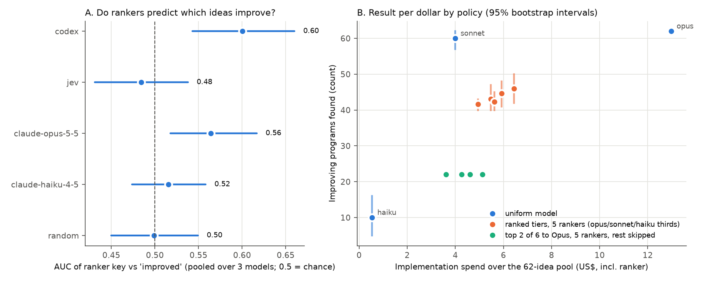

# Idea table v1: does ranking ideas before implementation pay off?

## Question and answer

**Question.** Does a ranker that judges ideas before any code is written (Jev, Claude, Codex)
predict which ideas improve the program? And which triage policy gives the best result per
dollar?

We implemented every idea with every model (Haiku 4.5, Sonnet 5.5, Opus 5.5) on Erdős squares
and scored each program with the integrity gate. This gives a counterfactual table. Any
ranker or routing policy can be replayed on it offline, at no API cost.

The experiment API key ran out of credit partway through: 146 of 342 cells are missing. All
results below use the **62 ideas that have a result from all three models**.

- **The implementer decided success, not the idea.** Opus improved the parent on 62 of 62
  ideas, Sonnet on 60 of 62, Haiku on 10 of 62. Starting from the k x k grid parent, almost
  any idea works if a strong model implements it. That leaves little for a ranker to predict.
- **P1 (ranker validity).** Pooled AUC, with 0.5 meaning chance:
  - Codex 0.600 [0.543, 0.660]
  - Claude Opus ranker 0.564 [0.518, 0.617]
  - Claude Haiku ranker 0.516 [0.474, 0.558]
  - Jev 0.484 [0.431, 0.538]
  - random 0.499 [0.450, 0.549]

  By the pre-registered criterion (lower bound above 0.5), Codex and the Opus ranker both
  predict improvement. Paired against the random ranker, only Codex is clearly above it:
  +0.102 [0.028, 0.178]. Opus is borderline at +0.065 [-0.002, 0.140]. The signal comes
  from Haiku's cells: Codex's AUC on
  Haiku outcomes is 0.929 [0.852, 0.983]. The rankers recognise ideas a weak model can
  implement. None predicts which programs reach the best known value: post-hoc AUCs are
  0.467-0.497.
- **P2 (does ranking help triage?) Null.** Each ranker's tiers minus random tiers, in
  improvements found:
  - Codex -3.0 [-7, 1]
  - Claude Opus -2.3 [-6, 2]
  - Claude Haiku -1.6 [-5, 3]
  - Jev +1.3 [-3, 5]

  Triage sends favourites to Opus, which succeeds on every idea anyway. A better ranker
  therefore takes the easy ideas away from Haiku. Reversing the split (favourites to Haiku)
  with Codex's ranking found +4.2 [0, 8] improvements. That comparison is post hoc.
- **Best result per dollar on this problem: Sonnet for every idea.** Uniform Sonnet found
  60.0 improvements for $4.00 [3.59, 4.43], reaching best public score 1.0 with hidden mean
  0.9974. For comparison:
  - uniform Opus: 62 improvements for $12.98
  - every triage-tier policy: 41.6-45.9 improvements for $4.95-$6.44
  - uniform Haiku: 10.0 improvements for $0.53, but it never reached the best known value
    (best public score 0.9921).

Implementation noise is **not measured**: the replicate step was queued after the main run
and never ran. Evaluation noise was zero: 12 programs evaluated twice gave identical scores.

## What we did

### Code

| File | Role |
|---|---|
| `autoresearch/ideatable.py` | Builds the table, one resumable CLI step at a time: `ideas`, `rank`, `implement`, `evaluate`, `table`, `fill`, `size`, `provenance`, `status`. Also holds the Codex ranker. |
| `autoresearch/spend.py` | Hard Anthropic spend cap. Each request reserves its worst-case cost (prompt plus `max_tokens`, at its own price plus the refusal-fallback price) before it is sent. A request that could exceed the cap is refused. Every call is logged to `usage.jsonl`, including failures. Several processes share the cap through that file. |
| `autoresearch/evalcode.py` | Scores one program source with `autoresearch.gate.evaluate`. Used both locally and in Modal. |
| `autoresearch/modal_eval.py` | Runs the gate on Modal: one container per program, 1 core, 1 GiB, numpy and scipy pinned to the local versions, no secrets. Worst-case Modal cost is reserved per container against a $5 cap. |
| `autoresearch/policy_eval.py` | Offline evaluation of rankers and policies, with a bootstrap over ideas. Reusable: pass `--extra-rankings` to score any new ranker against the table. |
| `autoresearch/mock_claude.py` | Deterministic stand-in for Claude, used for tests and dry runs. |
| `tests/test_ideatable.py` | 9 tests: spend cap, dedupe, outcome rules, tolerant parsing, AUC and kappa, an end-to-end mock run, billing stop and `fill`. |
| `experiments/idea-table-v1/summarize.py` | Writes `summary.json` and `figure.png` from the saved analysis. |

### Setup

The full protocol is in `PROTOCOL.md`, written before any live call.

- **Problem.** `problems/erdos_squares`. The parent is `initial.py`, a k x k grid with public
  score 0.8562 and hidden mean 0.9128.
- **Ideas.** Opus 5.5 proposed them using triage's `IDEA_SYSTEM`/`IDEA_USER` prompts (effort
  medium): 12 calls of 10 ideas, 120 ideas, none dropped as lexical duplicates. Ideas were put
  in a random order (seed 20261003), and the first N = 114 form the design (set by the sizing
  rule).
- **Implementations.** Each idea × {Haiku 4.5, Sonnet 5.5 at effort high, Opus 5.5 at effort
  high}, with triage's `IMPLEMENT_*` prompts and `max_tokens` 32000. Outcomes are classified
  exactly as `triage.Run.implement` does: `improved` means valid with public score above
  parent + 1e-9.
- **Rankers.** All were blind: they saw only the problem, the parent and the ideas, and
  `rankings.json` was committed (f9bdbe6) before any main-run program was scored.
  - random
  - `ClaudeRanker` with Haiku 4.5 and with Opus 5.5, one call per batch of 6 ideas
  - Jev (`JevRanker`), one call per idea
  - Codex: `codex exec` with gpt-6-astra at reasoning effort xhigh, read-only sandbox, empty
    working directory, no keys, one prompt holding all 114 ideas

  Every ranker saw each batch in its own shuffled order. The position each idea was shown in
  is recorded.
- **Policies replayed.**
  - `uniform:{haiku,sonnet,opus}`: one model implements every idea.
  - `tiers:R`: triage's thirds within each batch of 6. Favourites go to Opus, the middle to
    Sonnet, long shots to Haiku.
  - `tiers+swap:R`: as `tiers:R`, with 15% of assignments swapped.
  - `top{1,2,3}-opus:R`: Opus implements only the top k ideas of each batch; the rest are
    skipped.
  - `oracle-cheapest`: an unattainable reference that uses each idea's cheapest successful
    model.
  - `inverse-tiers:R` (post hoc): favourites go to Haiku, long shots to Opus.
- **Statistics.** 2,000 bootstrap resamples of ideas (seed 0). Batches of 6 are re-formed and
  random keys redrawn in every draw. Point estimates average 500 draws without resampling.
  Intervals are 2.5-97.5 percentiles.
- **Budgets.** Anthropic cap $40 and Modal cap $5, both enforced in code.

### Work log

1. Built and tested the pipeline end to end with the mock client. Committed `PROTOCOL.md`
   (2d8d311) before any live call.
2. **Ideas.** 8 Opus calls ($0.89) produced 80 ideas. Bug found before use: presentation order
   had been assigned call by call. Fixed with a single shuffle over the pool.
3. **Probe** (3 ideas x 3 models). Cost was $0.267 per idea, and 7 of 9 cells improved. This
   was the first sign of a ceiling.
4. **Sizing.** The rule gave N = 78, capped by the 80-idea pool. As disclosed in `PROTOCOL.md`,
   we ran 4 more Opus calls to reach 120 ideas, and the same rule then gave N = 114.
5. **Ranking.** `ClaudeRanker` in `autoresearch/rankers.py` crashed: models returned `"kind"`
   as a list, so the line `it.get("kind") in KINDS` raised `unhashable type`. This happened in
   all 19 batches for both Claude rankers. Those replies are now parsed by a tolerant parser,
   counted as `tolerant_parses` in `rankings.json`. We did not edit `rankers.py`; the triage
   loop still has this bug.
6. Presentation order was shuffled per ranker, following input from the team's literature
   review. Ranking and the main run were started together. To save wall time, a second
   implementation process took ideas 66-113 of the order. Both are disclosed in
   `PROTOCOL.md`.
7. **Credit ran out.** The experiment key ran out of credit at $19.73 of logged spend, well
   below our $40 cap.
   - The loop then marked every queued cell `api_error`: 146 cells, from 202 failed calls.
   - 12 calls failed mid-stream. Anthropic may have billed partial output for them; we logged
     it as $0.
   - Fix: billing errors now stop the run (`BillingStop`) and do not use up a cell's retries.
   - Added `fill`, a single command that completes the table.
8. **Evaluation.** All 196 finished programs plus 12 repeats were scored on Modal. A batch of
   repeats was interrupted by a session limit and rerun, which cost 10 extra containers.
9. Added post-hoc analyses: "solved" AUC, inverse tiers, missingness, the position check,
   rankers paired against random, and cross-model agreement.

**Deviations from the protocol.**

- Replicates were not run.
- The analysis uses 62 complete ideas rather than 114.
- The two budget levels were computed from the 62-idea pool: $1.48 and $2.96.

Everything marked post hoc above was not pre-registered.

## Results

All numbers are copied from `analysis.json` and `summary.json`, over the 62 complete ideas.
Values in brackets are 95% bootstrap intervals.

### Cells

| model | cells | improved | invalid | not better | mean $/cell | mean output tokens | mean LLM s | best public | matches best known on all public n |
|---|---|---|---|---|---|---|---|---|---|
| claude-haiku-4-5 | 62 | 10 | 19 | 33 | 0.0086 | 1564 | 11 | 0.9921 | 0 |
| claude-sonnet-5-5 | 62 | 60 | 2 | 0 | 0.0645 | 6252 | 52 | 1.0 | 31 |
| claude-opus-5-5 | 62 | 62 | 0 | 0 | 0.2093 | 10273 | 112 | 1.0 | 54 |

There were no refusals and no integrity flags. Every idea was improved by at least one
model.

### Rankers

Higher AUC and Spearman are better; lower Brier is better.

| ranker | $/idea | AUC pooled | AUC on Haiku cells | AUC on Sonnet cells | Spearman (key vs mean gain) | Brier pooled | AUC "solved" (post hoc) |
|---|---|---|---|---|---|---|---|
| random | 0 | 0.499 [0.450, 0.549] | 0.496 [0.292, 0.704] | 0.492 [0.075, 0.951] | -0.009 [-0.248, 0.245] | 0.334 [0.294, 0.375] | 0.497 [0.439, 0.559] |
| claude-haiku-4-5 | 0.00049 | 0.516 [0.474, 0.558] | 0.596 [0.411, 0.767] | 0.392 [0.197, 0.607] | -0.095 [-0.329, 0.145] | 0.260 [0.240, 0.280] | 0.474 [0.409, 0.542] |
| claude-opus-5-5 | 0.00390 | 0.564 [0.518, 0.617] | 0.760 [0.597, 0.889] | 0.646 [0.230, 1.000] | 0.195 [-0.073, 0.435] | 0.271 [0.238, 0.304] | 0.487 [0.429, 0.542] |
| codex | 0 (ChatGPT plan) | 0.600 [0.543, 0.660] | 0.929 [0.852, 0.983] | 0.629 [0.205, 1.000] | 0.262 [-0.022, 0.521] | 0.262 [0.225, 0.296] | 0.467 [0.404, 0.527] |
| jev | 0.00004 | 0.484 [0.431, 0.538] | 0.418 [0.215, 0.629] | 0.542 [0.150, 0.928] | -0.069 [-0.315, 0.183] | 0.222 [0.212, 0.231] | 0.482 [0.419, 0.547] |

Notes on the table:

- AUC on Opus cells is undefined, because every Opus cell improved.
- AUC on Sonnet cells rests on 2 failures, hence the very wide intervals.
- No ranker beats the Brier score of always predicting the base rate, 0.206 (base rate
  132/186 = 0.710).
- Pooled AUC minus random, paired:
  - Codex +0.102 [0.028, 0.178]
  - Opus ranker +0.065 [-0.002, 0.140]
  - Haiku ranker +0.017 [-0.053, 0.082]
  - Jev -0.015 [-0.092, 0.054]

**Haiku success rate by ranker tier** (thirds of each ranker's key over the 62 ideas):

| ranker | favourites | middle | long shots |
|---|---|---|---|
| random | 0.16 [0.05, 0.33] | 0.16 [0.05, 0.33] | 0.16 [0.00, 0.35] |
| claude-haiku-4-5 | 0.24 [0.05, 0.38] | 0.14 [0.00, 0.33] | 0.10 [0.00, 0.25] |
| claude-opus-5-5 | 0.33 [0.14, 0.52] | 0.14 [0.00, 0.33] | 0.00 [0.00, 0.10] |
| codex | 0.43 [0.24, 0.67] | 0.05 [0.00, 0.19] | 0.00 [0.00, 0.00] |
| jev | 0.14 [0.00, 0.29] | 0.07 [0.00, 0.24] | 0.27 [0.10, 0.50] |

For Sonnet and Opus, every tier of every ranker succeeds 0.95-1.00 of the time
(`analysis.md`).

**Position bias check.** This is the Spearman correlation between the position an idea was
shown in and its key.

- The Haiku ranker gave earlier ideas higher keys: rho = -0.443 (p = 0.0003).
- Opus ranker: -0.066. Jev: -0.131. Codex: 0.124. Random: 0.028. All p > 0.3.

Because positions were shuffled, this bias adds noise to the Haiku ranker's key but does not
bias its AUC.

### Policies over the 62-idea pool

Dollars include the ranker's own cost. More improvements and a higher score are better.

| policy | $ | improvements | improvements per $ | $ per improvement | best public | hidden mean of best |
|---|---|---|---|---|---|---|
| uniform:haiku | 0.53 [0.50, 0.57] | 10.0 [5.0, 16.0] | 18.72 [8.98, 30.27] | 0.053 | 0.9921 [0.9441, 0.9921] | 0.9789 [0.9555, 0.9789] |
| uniform:sonnet | 4.00 [3.59, 4.43] | 60.0 [57.0, 62.0] | 15.02 [13.34, 16.86] | 0.067 | 1.0 | 0.9974 [0.9904, 1.0000] |
| uniform:opus | 12.98 [11.54, 14.49] | 62.0 | 4.78 [4.28, 5.37] | 0.209 | 1.0 | 0.9985 [0.9879, 1.0000] |
| tiers:random | 5.92 [5.04, 6.83] | 44.6 [41.0, 48.0] | 7.57 [6.36, 8.96] | 0.133 | 1.0 | 0.9980 [0.9904, 1.0000] |
| tiers:claude-haiku-4-5 | 5.47 [4.80, 6.21] | 43.1 [40.0, 47.0] | 7.89 [6.80, 9.22] | 0.127 | 1.0 | 0.9983 [0.9904, 1.0000] |
| tiers:claude-opus-5-5 | 5.62 [4.88, 6.41] | 42.3 [40.0, 45.0] | 7.55 [6.58, 8.71] | 0.133 | 1.0 | 0.9978 [0.9904, 1.0000] |
| tiers:codex | 4.95 [4.31, 5.73] | 41.6 [40.0, 43.0] | 8.42 [7.25, 9.72] | 0.119 | 1.0 | 0.9976 [0.9879, 1.0000] |
| tiers:jev | 6.44 [5.47, 7.49] | 45.9 [42.0, 50.0] | 7.13 [5.93, 8.61] | 0.140 | 1.0 | 0.9982 [0.9904, 1.0000] |
| inverse-tiers:codex (post hoc) | 6.48 [5.60, 7.42] | 48.8 [44.0, 53.0] | 7.54 [6.36, 8.98] | 0.133 | 1.0 | 0.9981 [0.9904, 1.0000] |
| top2-opus:random | 4.61 [3.76, 5.51] | 22.0 | 4.81 [3.99, 5.86] | 0.209 | 1.0 | 0.9985 [0.9879, 1.0000] |
| top2-opus:codex | 3.61 [2.98, 4.37] | 22.0 | 6.11 [5.03, 7.39] | 0.164 | 1.0 | 0.9981 [0.9879, 1.0000] |
| oracle-cheapest (unattainable) | 3.78 [3.20, 4.41] | 62.0 | 16.41 [14.07, 19.38] | 0.061 | 1.0 | 0.9972 [0.9904, 1.0000] |

- Every policy that uses Sonnet or Opus reaches best public 1.0.
- Hidden means of the best program do not differ between policies: all paired intervals
  include 0.
- With Codex's ranking, top-2-to-Opus costs $3.61 against $4.61 for random ranking.
- The primary contrast (P2) is listed in the answer above. The other policies and contrasts
  are in `analysis.md`.



*Figure.* (A) Pooled AUC of each ranker's key; 0.5 is chance. (B) Implementation spend over
the 62-idea pool against improving programs found. Intervals are 95% bootstrap.

**Budget-matched runs.** These are batches of 6 run until the budget is reached; the budget
is checked before each batch, as triage does. At $2.96:

| policy | spent | improvements |
|---|---|---|
| uniform:sonnet | $3.12 | 46.8 [40.0, 54.0] |
| tiers:codex | $3.20 | 26.9 [23.0, 32.0] |
| tiers:random | $3.25 | 24.4 [19.0, 31.0] |
| uniform:opus | $3.70 | 17.6 [12.0, 18.0] |

All four reach best public 1.0. Uniform Haiku spends only $0.53 because it exhausts the pool.

### Missing cells (billing cutoff)

Of the 342 designed cells (114 ideas x 3 models), 146 are missing:

| | count |
|---|---|
| missing Haiku cells | 45 |
| missing Sonnet cells | 49 |
| missing Opus cells | 52 |
| ideas with no cell | 45 |
| ideas with some cells (partial) | 7 |
| ideas complete for all three models | 62 |

- **Where they are.** Missingness follows queue position. The complete ideas occupy positions
  0-34 (except 25) and 66-93 of the random presentation order. These are the heads of the two
  implementation processes' queues.
- **Partial ideas lack the slow models.** All 7 are missing Opus and 4 are missing Sonnet:
  those calls were still in flight when the credit ran out. Using partial ideas would bias
  per-model comparisons, so every analysis is restricted to complete ideas.
- **Bias check.** The presentation order is a seeded shuffle, so position is unrelated to
  idea content by construction. Two imbalances remain:
  - Ideas from the 4 extension calls (calls 8-11) make up 22.6% of complete ideas against
    29.8% of the design.
  - Codex rated complete ideas higher than missing ones (mean key 0.638 against 0.482,
    Mann-Whitney p = 0.052). For the other rankers p >= 0.16.

  Comparisons within the 62 ideas are valid. Extrapolating to the full pool is not.

## What it means, and what it does not show

- **Ceiling effect.** On this problem and parent, the question "which idea?" barely matters.
  Sonnet and Opus improve the grid whatever the idea says. Opus matched the best known value
  on all public instances in 54 of 62 programs. Most likely the models write the known
  Campbell-Staton construction regardless of the idea. We did not check program text against
  the idea, so idea adherence is unmeasured. The benchmark is informative mainly about Haiku,
  and about cost.
- **Rankers detect "easy to implement", not "valuable".** Codex and the Opus ranker separate
  ideas Haiku can implement from those it cannot. They do not predict which programs reach
  the best known value. This fits the literature review's expectation that prompted rankers
  sit near chance at predicting which idea wins.
- **The triage split works against its own ranker here.** If the strong model succeeds on
  everything, the cheap model should get the ideas most likely to work. That is the opposite
  of triage's design. The inverse split is a post-hoc finding and needs a confirmatory test.
- **Implementation noise is unmeasured.** No replicates ran. Cross-model agreement cannot
  stand in: kappa is about 0 because the Sonnet and Opus outcomes are nearly constant. If
  implementation noise is high, as reported elsewhere, it caps the AUC any ranker can reach
  and makes success by tier depend on the implementer. The `fill` command includes the 12
  replicate cells.
- **Scope.**
  - One round, one parent program, one problem, no feedback dynamics.
  - Triage's promotion and refine step is not evaluated.
  - One proposer (Opus).
  - Interval coverage assumes ideas are exchangeable.
  - 62 ideas.
  - The 12 mid-stream failures may have been billed but were logged at $0.
  - Codex used a different model family at maximum reasoning effort, and saw all ideas at
    once rather than 6 at a time.

## Cost

Recomputed from the logs (`summary.json` -> `cost`).

| item | amount |
|---|---|
| Anthropic, total logged | **$19.725** |
| ideas | $1.496 in 12 calls |
| implementations | $17.727 in 398 calls, of which 202 failed when the credit ran out |
| Claude rankers | $0.503 in 39 calls, including the crashed first attempt |
| tokens | 330,748 input / 1,225,929 output |
| Jev | $0.005, at `JEV_PRICE_PER_MTOK` |
| Codex | $0 marginal (ChatGPT plan); 389 s |
| Modal | about $0.39 at list rates, for 218 containers |
| gate evaluations | 208 (196 programs + 12 repeats), plus 10 interrupted repeats |

**Wall time.** API calls ran Saturday 19:51-20:35 by the laptop clock. Modal evaluation ran
until 22:21, ending with a 503 s repeat batch rerun. The offline analysis takes about 15 s.

## Reproduce

From the repository root:

```bash
PY=python        # Python 3.12 with requirements.txt installed
$PY -m pytest tests/test_ideatable.py -q                                   # 9 tests, no network
$PY -m autoresearch.policy_eval experiments/idea-table-v1                 # analysis.json/.md, ~15 s, no API
$PY experiments/idea-table-v1/summarize.py                                # summary.json, figure.png

# Score a new ranker against the table at zero implementation cost (adding a ranker changes the
# random stream, so other rankers' intervals can move in the last digit):
$PY -m autoresearch.policy_eval experiments/idea-table-v1 --extra-rankings my_ranker.json --out /tmp/new

# Complete the table: implements the 146 missing cells and the 12 replicates, skips finished
# cells, evaluates on Modal, rebuilds table.jsonl. Needs API credit; the $40 cap still applies.
$PY -m autoresearch.ideatable fill experiments/idea-table-v1 --dry-run     # cost estimate only
$PY -m autoresearch.ideatable fill experiments/idea-table-v1
```

**Fill estimate.** At the mean measured cost per cell, the 158 missing cells (49 Haiku, 53
Sonnet, 56 Opus) cost **$15.53**. That would bring logged spend to about $35.3 of the $40 cap.
If every cell cost as much as the most expensive one observed, the fill would cost about
$35.7, more than the $20.27 left, and the hard cap would stop it early. See
`fill_estimate.json`.

**Building a new table from scratch** spends API money. Run the steps in this order:
`ideas`, `implement --ideas 0:3` (the probe), `size`, `rank --n N`, `implement --ideas 0:N`,
`evaluate --host modal`, `table`. Each step is a subcommand of
`python -m autoresearch.ideatable`; `--help` lists the options, and `--mock` runs everything
offline.

## Evidence index

| file | contents |
|---|---|
| `PROTOCOL.md` | Pre-registered design, with the later changes at the end |
| `RESULTS.md` | This file |
| `summary.json` | Headline numbers, machine-readable |
| `analysis.json`, `analysis.md` | Full offline evaluation: every policy, ranker, contrast, budget level, missingness and noise result |
| `figure.png` | Ranker AUCs, and spend against improvements by policy |
| `table.jsonl` | One row per cell (342): outcome, scores, hidden mean, cost, tokens, times, code hash, evaluation host and repeat |
| `ideas.json` | The 120 ideas with their generating call and presentation order, plus raw Opus responses and costs |
| `rankings.json` | Each ranker's judgement of the 114 design ideas: tier, p_improve, key, batch and shown position |
| `parent.json` | Parent program, its score, hidden mean and feedback |
| `sizing.json` | Probe costs and the N computed by the pre-registered rule |
| `fill_estimate.json` | Cost estimate for completing the table |
| `config.json` | Settings, package versions and SHA-256 of every source file used |
| `usage.jsonl` | Every Anthropic call, including failures: tag, model, tokens, cost, reservation |
| `modal_usage.jsonl` | Every Modal container, with estimated cost |
| `cells/<idea>__<model>__r<rep>/` | `call.json` (call record), `program.py` (generated code), `eval.json` (gate result), `eval_repeat.json` where a repeat exists |
| `traces/*.json.gz` | Prompt and response of every Claude call, and the Codex event stream |
| `summarize.py` | Writes `summary.json` and `figure.png` |

## Next steps

1. Run `fill` once the key has credit (about $15.5). This completes the 114-idea design and
   adds the implementation-noise replicates.
2. Give the table headroom, with a parent or problem where strong models do not saturate. For
   example, start from the best Opus program here, or use `sum_difference` or
   `circle_packing`. The harness takes any `problems/` folder.
3. Make a graded outcome the primary endpoint: score gain, or "reaches best known".
4. Run a confirmatory test of the inverse split (cheap model gets the favourites).
5. Fix `ClaudeRanker`'s parser in `autoresearch/rankers.py` so it tolerates list-valued
   fields.

## Suggested README text

For `autoresearch/README.md`:

> **Idea table (counterfactual benchmark for triage policies).**
> `python -m autoresearch.ideatable` implements every idea with every model and scores each
> program with the integrity gate. Spend is hard-capped, and the steps are resumable.
> `python -m autoresearch.policy_eval <folder>` then replays any ranker or routing policy
> offline, with bootstrap intervals. A new ranker is scored against the saved table at zero
> implementation cost with `--extra-rankings`.
>
> On Erdős squares (experiments/idea-table-v1, 62 complete ideas):
> - Opus improved the grid parent for every idea.
> - Codex and the Claude Opus ranker predicted which ideas Haiku could implement, with pooled
>   AUC 0.600 and 0.564. Jev and the Claude Haiku ranker did not.
> - No ranker improved triage over random tiers.
> - Uniform Sonnet gave the best result per dollar.
