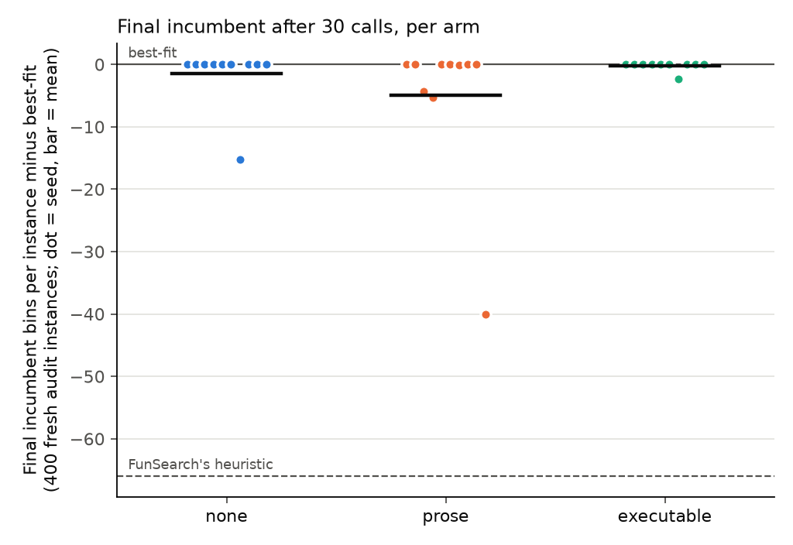

# Memory ablation v1: do executable counterexamples help a closed-loop LLM search?

## Question and answer

**Question.** In a closed loop where claude-haiku-4-5 proposes one candidate per call and the
harness evaluates, promotes and writes the next prompt with no human edits, does memory of
executable counterexamples give better audited final policies than no memory, or than a
prose summary of the same failures?

**Answer: no evidence that it does. Both studies are null or inconclusive on the primary
endpoint, and in the confirmatory study executable memory had the worst point estimate.**

- **Confirmatory (Weibull 5k, code, 10 seeds × 3 arms × 30 calls).** Mean audited excess bins per
  instance of the final incumbent over best-fit (lower is better): none −1.52, prose −4.96,
  executable −0.24. FunSearch's published heuristic scores −65.97 on the same audit. Paired by
  seed: executable − prose +4.73 [−0.23, +12.96]; executable − none +1.29 [+0.00, +3.86];
  prose − none −3.44 [−12.86, +3.57]. All three intervals include zero. Most runs never left
  best-fit (none 9/10, prose 5/10, executable 9/10), so these means rest on a few runs. The
  largest single effect is one prose run (seed 9, −40.0).
- **What memory changed was behaviour, not outcomes.** Harmful proposals (worse than best-fit
  on a fresh diagnostic suite): none 0.803, prose 0.202, executable 0.147 (executable − prose
  −0.055 [−0.105, −0.005]). But no-op proposals, which pack exactly like the incumbent and
  cannot be promoted, rose from 0.133 (none) to 0.650 (prose) and 0.815 (executable)
  (executable − prose +0.165 [+0.055, +0.301]). Memory made the model cautious, and executable
  memory most of all.
- **Deviation: memory was not token-matched.** Prose memory averaged 1,172 tokens per call and
  executable memory 934 (budget 1,500 each). The executable arm had less material to show (see
  below), so the prose-versus-executable comparison mixes the form of the evidence with its
  amount.
- **Pilot (20-feature weights regime, 2 seeds).** No proposal was promoted in any run: the
  primary endpoint was 0 in every arm, which is a floor. Memory cut harmful proposals there
  too (none 0.983, prose 0.133, executable 0.383).
- None of the 17 distinct promoted candidates is a near-copy of FunSearch's heuristic: the
  highest decision agreement with it was 0.782.

## What we did

### Built (all new code; tests in `tests/test_closed_loop.py` and `tests/test_closed_loop_code.py`)

| File | Role |
|---|---|
| `falsify/llm.py` | Spend-capped Claude proposer. Each request reserves its worst-case cost before sending, using the `autoresearch/claude.py` prices. Every attempt is logged to `usage.jsonl`. Includes an offline mock client. |
| `falsify/closed_loop.py`, `falsify/backends.py`, `falsify/memory.py` | Pilot loop, the 20-feature weights backend, and the memory builders. Also the audit and the paired bootstrap. |
| `falsify/closed_loop_code.py` | Confirmatory loop for `priority(item, bins)` code on 5,000-item Weibull instances, plus its audit and CLI (`--help`). |
| `falsify/code_eval.py` | Sandboxed evaluation of model code. Long instances go through the gate's own `run_online`. A persistent online child handles short-stream mining and shrinking, and kept counterexamples are re-checked in fresh processes. Also computes FunSearch similarity. |
| `falsify/memory_code.py` | Prose and executable memory sections for the code regime. |
| `falsify/memory_ablation_modal.py` | Modal back end (app `ssm-memory-ablation`). Containers have no network, no secrets and no Modal access. Worst-case cost is reserved per call against a $5 cap. |
| `experiments/memory-ablation-v1/build_report.py` | Regenerates `tables.md`, `summary.json` and the figure from saved data. |

### Setup

Both studies use the same three arms, which differ only in the memory section of the prompt:

- **none**: the incumbent and its scores only.
- **prose**: verbal summaries of earlier proposals that were not promoted. Each gives the idea, the scores, losses, and how the policy first departed from the reference.
- **executable**: up to two shrunk losing inputs per proposal, with both packings and the first different decision.

Both memory arms have a 1,500-token budget, counted with the API's token counter. A seed fixes harness randomness (suites, probes), not model sampling. Promotion is score-only: strictly fewer total bins than the incumbent on the run's fixed suite. Audit seeds come from the SHA-256 of all finished traces. Full design: [PROTOCOL.md](PROTOCOL.md).

| | Pilot | Confirmatory |
|---|---|---|
| Problem | 20 bounded feature weights; 80-item synthetic families | Python `priority(item, bins)`; Weibull(45, 3) 5,000-item instances (FunSearch setting) |
| Seeds × arms × calls | 2 (100, 101) × 3 × 30 | 10 (0-9) × 3 × 30 |
| Fixed search suite | 400 instances | 5 × 5,000 items |
| Counterexamples | Probe losses vs best-fit, shrunk by deletion | Losing 40-item streams vs the incumbent (and best-fit), shrunk to ≤30 items |
| Audit | 1,600 instances, 8 families | 400 fresh 5,000-item instances |
| Diagnostic suite | 800 instances | 10 × 5,000 items |
| `max_tokens` | 1,024 | 2,048 |

### Work log, deviations and bugs

- The protocol was written before the pilot. The confirmatory section was added and
  committed at 20:22:17 (96f217d), before the first confirmatory call at 20:22:41. It adds
  a no-op sentence to the prompt in all arms, the no-op secondary endpoint and the FunSearch
  similarity endpoint.
- **Token mismatch (deviation).** The memory arms were meant to fill the same budget. Realized
  means were 1,172 tokens (prose) and 934 (executable). Likely cause: an executable entry needs
  a losing input. Proposals that pack exactly like the incumbent lose nowhere, so they have no
  entry, and they were 81.5% of the executable arm's valid proposals. A prose entry exists for
  every non-promoted proposal. The median prompt therefore had 4 candidate entries in the
  executable arm against 14.5 in prose. The 8-counterexample cap was within one of binding in
  75 of 300 executable calls. Consequence: the executable arm saw about 20% fewer memory tokens
  and could not mention no-op proposals at all. Its result is therefore not a clean test of
  executable form at equal tokens. Nothing was rerun, because the API key has no credit left.
- **Known threat, measured before launch and confirmed.** Short streams packed from empty bins
  disagree with the 5,000-item objective: FunSearch's heuristic loses to best-fit on 200 of 200
  short streams. 61 of the 82 counterexamples kept in the executable arm are 2-item streams. In
  62 of the 82, the policy opened a new bin while an open bin had room, which is the kind of
  move that wins over long horizons. The executable evidence therefore pushed against such moves.
- The pilot's strict shadow gate was not carried into the code regime. The confirmatory
  protocol does not mention it.
- After launch, while the searches were running, the similarity analysis was added to the
  audit code. The search code was not touched. Search source hashes are in
  `confirmatory/config.json`; audit source hashes are in `confirmatory/summary.json`.
- Bug found and fixed before writing up: `build_report.py` counted counterexamples twice
  whenever the incumbent was best-fit, because both reference keys point to the same mining
  pass. The audit's `shrink_trials` already handled this.
- After the pilot, three descriptive metrics were added to its audit, and its audit was re-run
  as a pure function of the traces (PROTOCOL.md amendment 1).
- One API connection error (none-s0, call 1) was retried. It was charged as its full
  reservation of $0.0151, an upper bound.
- No run exposed a gate or sandbox problem. Gate rejections were rare (2 in the none arm) and
  generic. Runtime failures were caught and counted as failed calls.

## Results

### Study 1: pilot (weights regime; not pooled with the confirmatory study)

| Arm | Final audited excess (bins/instance) | Harmful proposals | Mean diagnostic excess of proposals | Proposals packing like the incumbent (mean per run) | Memory tokens (mean) | Cost per run (USD) |
|---|---:|---:|---:|---:|---:|---:|
| none | +0.0000 | 0.983 | +0.713 | 0.5 of 30 | 0 | 0.1254 |
| prose | +0.0000 | 0.133 | +0.016 | 28.0 of 30 | 1258 | 0.1668 |
| executable | +0.0000 | 0.383 | +0.094 | 20.0 of 30 | 1160 | 0.1608 |

No promotions in 180 calls. Every final incumbent is best-fit, and no proposal beat best-fit on
the diagnostic suite. With no memory, the model kept proposing large rewrites. With memory it
retreated to best-fit plus tiny weights; prose went furthest.

### Study 2: confirmatory (Weibull 5k, code; seeds 0-9)

Primary endpoint: the final incumbent on 400 fresh 5,000-item instances. Mean excess bins per
instance over best-fit; lower is better and 0 means best-fit.

| Arm | Mean excess bins/instance | Runs whose final incumbent is still best-fit | Promotions per run | Delta vs best-fit, percentage points of L2 excess |
|---|---:|---:|---:|---:|
| none | -1.52 | 9 of 10 | 0.7 | -0.077 |
| prose | -4.96 | 5 of 10 | 0.9 | -0.250 |
| executable | -0.24 | 9 of 10 | 0.1 | -0.012 |
| FunSearch Weibull heuristic (fixed reference, not an arm) | -65.97 (instance 95% CI [-66.44, -65.49]; 400/0/0 wins/ties/losses) | | | -3.324 |

Best-fit uses 2064.16 bins per instance, 4.018% above the L2 lower bound.



Paired contrasts (difference of arm means, paired by seed; 95% bootstrap interval, 10,000 resamples):

| Metric | executable - prose | executable - none | prose - none |
|---|---|---|---|
| Final audited excess (bins/instance) | +4.73 [-0.23, +12.96] | +1.29 [+0.00, +3.86] | -3.44 [-12.86, +3.57] |
| Harmful proposals (share of valid) | -0.055 [-0.105, -0.005] | -0.656 [-0.737, -0.540] | -0.601 [-0.700, -0.449] |
| Worse than incumbent of the time (share of valid) | -0.044 [-0.088, +0.006] | -0.648 [-0.737, -0.516] | -0.604 [-0.683, -0.502] |
| No-op proposals (share of valid) | +0.165 [+0.055, +0.301] | +0.682 [+0.606, +0.745] | +0.517 [+0.370, +0.635] |
| Repeats of an earlier failed proposal (count per run) | +4.200 [+2.700, +6.000] | +7.100 [+5.700, +8.800] | +2.900 [+0.500, +5.000] |
| Reverts to a former incumbent (count per run) | -1.100 [-4.600, +1.400] | +0.100 [+0.000, +0.300] | +1.200 [-1.100, +4.600] |
| Best fixed-suite result (bins/instance vs best-fit) | +4.72 [-0.40, +13.24] | +1.06 [+0.00, +3.18] | -3.66 [-13.10, +3.32] |

Repeats count proposals that pack the fixed suite exactly like an earlier non-promoted proposal,
so repeated no-ops are included. Reverts count proposals that pack exactly like a former
incumbent. The team's literature review cites Pelleriti et al. (2605.20086): about 30% of added
lines re-add deleted code. Our reverts are rare (0.5-1.7 per run), but repeats are common.

Per-arm secondaries, memory fill and FunSearch-similarity tables are in [tables.md](tables.md),
generated from `confirmatory/summary.json` and `confirmatory/audit.json`. Seven runs ended with
a non-best-fit incumbent: none 1, prose 5, executable 1. Their mean decision agreement with
FunSearch's heuristic was 0.654, 0.595 and 0.585.

## What it means and what it does not show

- The study does not support the claim that executable counterexamples make an LLM search
  better. With 10 seeds and most runs stuck at best-fit, it cannot rule out a small effect in
  either direction. The point estimates favour prose.
- Memory of failures makes Haiku avoid harm mainly by doing nothing. Fewer harmful proposals
  came with many more no-op proposals, in both regimes. A "fewer harmful proposals" result is
  not progress unless promotions rise as well.
- The executable evidence here came from short streams, and it systematically argued against
  the moves that win at 5,000 items. That is a property of this counterexample generator, not
  of executable memory in general. The prose arm summarised the same evidence verbally, so it
  was exposed to it too, but less concretely.
- Token mismatch: see the deviation above. The executable arm had about 20% fewer memory tokens
  and covered fewer earlier proposals.
- One model (claude-haiku-4-5), 30 calls per run, default sampling. Seeds fix harness inputs,
  not model samples. Intervals are conditional on the shared audit and diagnostic suites.
- FunSearch's heuristic is public. No promoted candidate was a near-copy (maximum agreement
  0.782), so this does not affect the comparison between arms. It does qualify any claim that a
  run "found" a better-than-best-fit rule: Haiku may know the idea.
- Even the best run (prose seed 9, a first-fit rule that penalises leftovers of 1-20) recovered
  only about 60% of FunSearch's margin over best-fit.

## Cost

Recomputed from every `usage.jsonl` and `modal_usage.jsonl` in this folder (see tables.md, "Spend by folder").

- Anthropic: $3.8169 in total. Pilot $0.9059 (180 calls), confirmatory $2.8755 (901 attempts,
  1 failed; 1,453,678 input and 281,350 output tokens), smoke $0.0092, checks $0.0263. The cap
  was $15.
- Modal: estimated $0.3693 in total, of which confirmatory $0.3496: 900 evaluation calls, 978
  audit shards and 17,264 remote seconds. The cap was $5. Evaluation calls are priced by wall
  time, plus an idle allowance per phase, so this overstates billed compute.
- Wall time: confirmatory searches took 12.5 minutes (15 runs in parallel). The audit took 779 s.
- Evaluator work per run, from `confirmatory/summary.json`, means over runs:

| Arm | Short-stream executions | Shrink trials | Evaluation seconds |
|---|---:|---:|---:|
| none | 6,038 | 4,448 | 186 |
| prose | 2,800 | 1,120 | 174 |
| executable | 2,465 | 940 | 154 |

  Each valid proposal also packs 5 × 5,000 items for the fixed suite.

## Reproduce

From the repository root (Python 3.12 with `requirements.txt` installed; Modal authenticated
for `--modal`; an Anthropic key in `.env` for live runs):

```sh
python -m pytest tests/test_closed_loop.py tests/test_closed_loop_code.py -q
# Pilot
python -m falsify.closed_loop run --out experiments/my-pilot --seeds 100 101 --cap-usd 3
python -m falsify.closed_loop audit --out experiments/my-pilot
# Confirmatory
python -m falsify.closed_loop_code run --out experiments/my-conf --seeds 0 1 2 3 4 5 6 7 8 9 --cap-usd 9 --modal --workers 15
python -m falsify.closed_loop_code audit --out experiments/my-conf --modal --expect-seeds 0 1 2 3 4 5 6 7 8 9
# Offline check with a mock model (no API, no Modal)
python -m falsify.closed_loop_code run --out /tmp/mock --seeds 1 --calls 3 --cap-usd 1 --mock --items 600 --fixed-instances 2
# Rebuild tables, summary.json and the figure from the saved data in this folder
python experiments/memory-ablation-v1/build_report.py
```

A new run produces different proposals, because model sampling is not seeded. The audit is a
pure function of the traces: `audit --force` reproduces the saved audit.

## Evidence index

| Path | Contents |
|---|---|
| `PROTOCOL.md` | Pre-registration of both studies and the dated amendments. |
| `RESULTS.md` | This file. |
| `tables.md` | Every results table, generated by `build_report.py`. |
| `summary.json` | Headline numbers for both studies and spend, machine-readable. |
| `confirmatory_figure.png` | Final audited excess per seed and arm, with best-fit and FunSearch reference lines. |
| `build_report.py` | Regenerates `tables.md`, `summary.json` and the figure. |
| `smoke/` | Two-call live check of structured output (seed 900); not analysed. |
| `pilot/config.json`, `pilot/source/` | Pilot settings, source snapshot and hashes. |
| `pilot/runs/*.json.gz` | Six pilot traces: every prompt, response, evaluation, counterexample and promotion. |
| `pilot/usage.jsonl` | Every pilot API attempt with tokens and cost. |
| `pilot/audit.json`, `pilot/audit_cases.json.gz`, `pilot/summary.json` | Pilot audit per run, the audit instances, and the arm summary with contrasts. |
| `checks/modal-mock/`, `checks/live-code/` | Infrastructure checks before the confirmatory run (mock on Modal; live seed 903, 3 calls per arm); not analysed. |
| `confirmatory/config.json`, `confirmatory/source/` | Confirmatory settings, per-invocation source hashes and snapshot. |
| `confirmatory/runs/*.json.gz` | 30 traces: prompts, responses, code, evaluations, counterexamples, memory token counts, promotions. |
| `confirmatory/usage.jsonl`, `confirmatory/modal_usage.jsonl` | Every API attempt and token count; every Modal call with reservation and estimate. |
| `confirmatory/run.log`, `confirmatory/audit.log` | Console logs of the search and the audit. |
| `confirmatory/audit.json` | Per-run metrics, per-policy audit rows, audit bins, diagnostic means, FunSearch similarity. |
| `confirmatory/summary.json` | Arm summaries, paired contrasts, references, audit seeds, trace digest, spend. |

## Next steps

- Repair the token match before any rerun (needs API credit). Either give the executable arm a
  one-line entry for no-op proposals, as prose has, or count only the shared part of the memory
  against the budget.
- Mine counterexamples on the scale of the objective, for example losing 500-1,000-item
  windows mid-stream, so that executable evidence does not penalise long-horizon moves.
- Add a cost for no-op proposals, or reject them before the call counts, so that caution cannot
  replace progress.
- The team's literature review (`context/related-work.md` on `docs/related-work`) cites Karimi
  et al. (2510.08755): LLM-distilled diagnoses of counterexamples beat raw counterexamples in the
  prompt. This suggests a fourth arm for a follow-up study; it was not tested here.
- More seeds. With 30 calls, most runs never leave best-fit, so an informative primary contrast
  needs many more runs or longer runs.

## Suggested README text

> **Memory ablation (closed loop, Haiku 4.5).** Prose and executable failure memory were
> compared with no memory, over 30-call closed-loop searches (10 seeds per arm, Weibull 5k,
> `priority(item, bins)`). Executable counterexamples did not improve the audited final
> policy: executable − prose +4.73 bins per instance [−0.23, +12.96], executable − none +1.29
> [+0.00, +3.86]. Memory of either kind cut harmful proposals (from 80% to 15-20%), but it did
> so by making the model propose no-ops (65-82% of proposals). See
> `experiments/memory-ablation-v1/RESULTS.md`.
