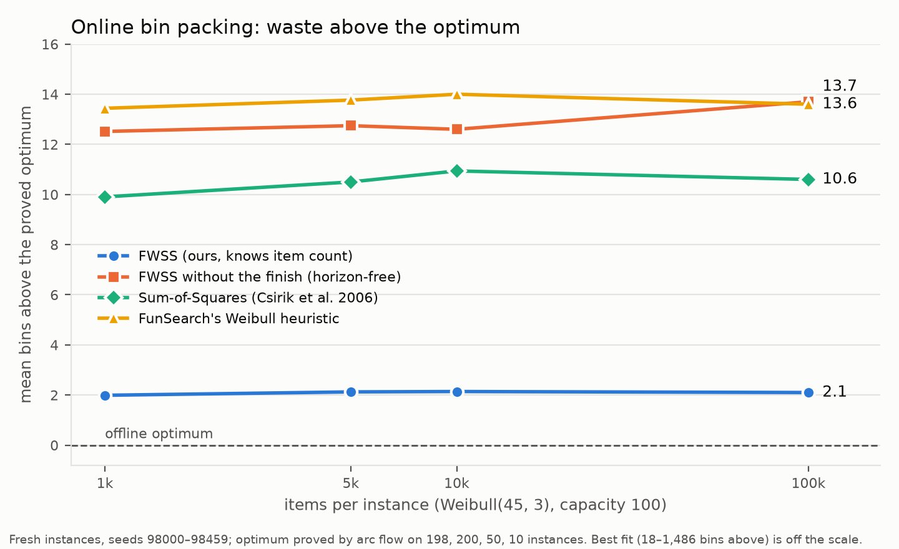
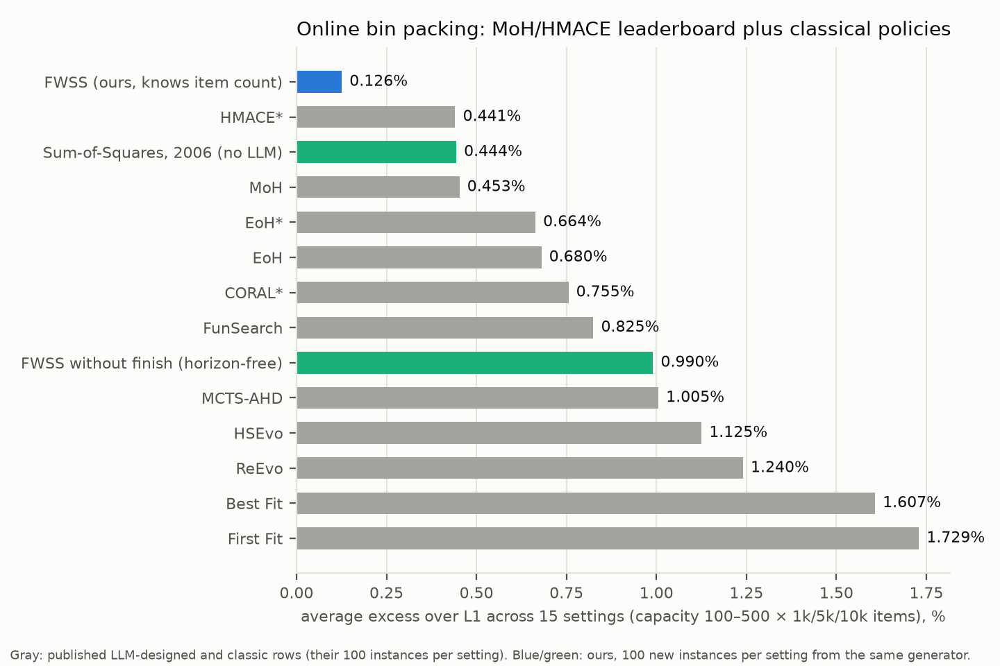

# online-beyond-ss-v1: FunSearch's online bin-packing benchmark is about 2 bins from optimal, not 14

**Question.** How far are FunSearch's and later LLM-designed heuristics from the offline optimum on
their own online bin-packing benchmarks? Can a simple, explainable online policy close the gap?

**Answer.** Yes. FWSS, a two-part classical-style policy, ends about **2 bins above the proved optimum**
on Weibull instances at every length from 1,000 to 100,000 items. FunSearch's evolved heuristic ends
about 14 above. FWSS beats every published LLM-designed heuristic we could compare against. FWSS is:
- Sum-of-Squares weighted by how hard each gap is to fill, learned online;
- plus a best-fit finish over the last few dozen items.

All numbers are from the pre-registered confirmatory run (`tables.md`, `tables_moh.md`).
- **FunSearch's own released Weibull 5k test data.** FWSS uses **0.080%** more bins than the L1 bound,
  1.6 bins above the proved optimum.
  - FunSearch's published heuristic: 0.684% (13.6 bins above).
  - Sum-of-Squares: 0.483% (9.6 bins above).
  - FWSS wins all 5 instances, by 12.0 bins each on average.
- **200 fresh 5k instances.** FWSS 0.107% vs FunSearch 0.693%. FWSS − FunSearch = **−11.64 bins per
  instance [−12.05, −11.23]**, 200 wins / 0 ties / 0 losses.
- **The same holds at every length:**

  | Items | FWSS | FunSearch | FWSS − FunSearch, bins per instance |
  |---|---|---|---|
  | 1k | 0.501% | 3.374% | −11.4 (200/0/0) |
  | 10k | 0.054% | 0.353% | −11.9 (50/0/0) |
  | 100k | 0.005% | 0.034% | −11.5 (10/0/0) |

  FunSearch's published numbers are 0.32% at 10k and 0.03% at 100k.
- **The offline optimum equals L1** on every C = 100 Weibull instance where arc flow proved it: 484 of 486. So the whole of FunSearch's 0.68% is online waste, and FWSS removes about 85% of it.
- **The 2026 LLM leaderboard.** MoH (ICLR 2026) and HMACE (2026) cover 11 methods × 15 settings (capacity
  100–500 × 1k/5k/10k items).
  - FWSS is **below the best published number in 15 of 15 settings**, and by more than 2 standard errors
    in 14.
  - Averaged over the 15 settings: FWSS **0.126%**, the best LLM method (HMACE*, GPT-5.4) 0.441%, MoH
    0.453%, EoH 0.680%.
  - Plain Sum-of-Squares (2006, no tuning) averages 0.444%, a tie with the best LLM method.
  - Caveat: our instances are new draws from the same generator, because theirs are not public.
- **FunSearch's OR benchmark (OR-Library u120–u1000).** FWSS uses 4.69 / 3.30 / 1.91 / 1.10% against
  FunSearch's OR heuristic at 5.30 / 4.19 / 3.11 / 2.47%.
  - Significant on OR3 (−2.4 bins, 18/0/2, p = 0.0004) and OR4 (−5.5, 19/0/1, p = 4e-5).
  - On OR2 the CI excludes 0 but the sign test does not (−0.9 [−1.7, −0.1], 12/3/5, p = 0.14).
  - Not significant on OR1 (−0.3 [−0.75, +0.15]).
- **It is a drop-in program.** As a stateful FunSearch `priority(item, bins)` it gives identical bin
  counts through FunSearch's evaluator. Through this repository's integrity gate it scores **0.99924**
  on `problems/bin_packing_online`. FunSearch scores 0.9925 there, and best fit 0.9616.

**What makes it work.** Alone, the weights make SS worse, and the finish removes less than half of
SS's waste. Together they remove about 80%. Bins above the optimum on fresh 5k instances:

| Policy | Bins above OPT |
|---|---|
| SS | 10.5 |
| Weights only (FWSS-no-finish) | 12.7 |
| Finish only (SS+finish) | 6.0 |
| Both (FWSS) | 2.1 |

The mechanism, measured on tuning seeds (`mechanism.json`), is that all the waste is the gap left in
bins still open at the end:
- SS ends with ~67 open bins holding 1,115 units of gap, more than half of it in gaps under 30 that few
  Weibull items fit.
- FWSS's weights keep only ~28 open bins, with almost all their gap (1,293 of 1,341 units) at 30 or above.
- The best-fit finish then absorbs 1,086 of those units in the last ~49 items. Applied to SS's
  inventory, it absorbs only 480.

**Caveats, up front.**
- **FWSS knows the item count T.** FunSearch's and EoH's evaluators reveal it: one bin per item, unused
  bins shown. But none of the LLM-designed heuristics used it.
- Without T, the same weights are *worse* than SS. The best horizon-free policy we know on these sets is
  still plain SS, which online-frontier-v1 tests separately.
- **FWSS keeps state:** its own placements and past sizes. These results say what the benchmark allows,
  not what any LLM search could have found inside a stateless interface.
- **Weighted SS objectives are a known family.** Csirik et al. 2006 study level-weighted variants
  (Σ N(h)² f(h,B), §8.1, Theorem 8.1). What is new is fill-based weighting, a horizon-aware finish, and
  the comparison on these benchmarks.





## What we did

### The policy
N(g) is the number of open bins with remaining gap g.

1. **Fill-weighted Sum-of-Squares.** Each item goes where it least increases Σ_g F(g)^-1.5 · N(g)².
   - F(g) = (1 + #{seen sizes ≤ g}) / (1 + #seen) is the empirical CDF of the sizes seen so far, learned
     online.
   - So a bin whose gap few items can fill is expensive to keep open.
   - Ties go to the smaller remaining gap.
2. **Best-fit finish.** Once (items left) × (mean size so far) ≤ 1.5 × (total open gap), the policy uses
   best fit for the rest of the sequence.

There are no distribution- or capacity-specific constants. The policy is about 40 lines in Python
(`priority_fss.py`, ~0.75 s per 5,000-item instance) and about 30 lines in C (`csrc/wss.c`).

### Steps
1. **Diagnosis.** SS ends each 5k instance with ~67 open bins. All its waste (~10 bins) is their gap, and
   ~40 of those bins have gaps under 15 (`RUN_LOG.md`).
2. **Exploration.** On tuning seeds 90000–90199, in this order:
   - SS weighted by gap^-α;
   - a best-fit finish over the last K items;
   - a finish triggered by volume;
   - weights from the empirical CDF.
3. **Fast implementation.** C packer, checked decision-for-decision against Python reference code
   (`check_c.py`; `sim.pack_fss_py` vs `fast.pack_fss` on 32 cases).
4. **Generality check before freezing,** on training-style draws only (the EoH generator at C = 100 and
   500; uniform 20–100 sizes at C = 150, OR-like).
   - A fixed gap^-2 weight was worse than SS at C = 500.
   - CDF weights fix this: when no item exceeds 100, a gap of 120 is as easy to fill as one of 400.
5. **Freeze.**
   - `config.json`: β = 1.5, α = 0, c = 1.5. They were chosen on training-style data by the rule written
     in `PROTOCOL.md`; `sensitivity.md` shows the whole grid.
   - `PROTOCOL.md` was hashed into `RUN_LOG.md` before the confirmatory run.
   - Amendment 1 (the MoH/HMACE leaderboard) was hashed before its sets were generated.
6. **Confirmatory runs.**
   - `run.py`: 587 test instances in 19 sets, with ten policies and arc-flow OPT.
   - `run_moh.py`: 1,500 instances in the 15 leaderboard settings.
7. **Drop-in checks.**
   - `check_priority.py`: FunSearch's evaluator.
   - `gate_check/`: the repository's integrity gate.
8. **Literature check** (`literature.md`, 38 LLM heuristic-design papers in full text, plus the
   classical prior art). Key numbers (MoH, HMACE, CGPP's setup, Csirik §8.1) were re-checked against
   the PDFs by this session.

### Work log: decisions, dead ends, bugs
The full timestamped log is `RUN_LOG.md`. The points that matter for a reader:

- **Contamination, disclosed.** Before freezing, three early configurations were scored on FunSearch's 5
  released instances. FWSS itself was not. After that the released set was set aside.
- **Dead end:** a fixed gap^-α weight. It is good at C = 100 but worse than SS at C = 500, which is why
  the weights come from the learned CDF.
- **Dead end:** horizon-free weighting. The best variant on tuning data is 8.6 bins above L1 at 5k, against
  SS 10.6. On the test sets FWSS-no-finish is worse than SS.
- **Dead end:** a smarter finish. A one-step rollout finish gains only ~0.1 bin (`v2/rollout.c`), so the
  remaining ~2 bins are not a weak finish.
- **Timing bug.** Early RUN_LOG rows had guessed times; they were corrected from `date`.
- **Correction (4 October, after review): u250_12's optimum.**
  - The original tables used OR-Library's listed 106 for u250_12, because this study's arc-flow solve was
    unproved (incumbent 129, bound 105).
  - An independent review found that online-frontier-v1 packs it in 105 bins, which equals L1. The
    packing was re-verified here (`verify_overrides.py`, `opt_overrides.json`), and `report.py` now uses 105.
  - Effect: OR2's "bins above OPT" rises by 0.05 for every policy (`tables.md`, section 2), and OR2's
    OPT − L1 is now 0.05.
  - Unchanged: excess over L1 and every paired contrast.
  - So four OR-Library listings are not optimal: u120_08, u120_19, u250_07 and u250_12.
- **Label bug (fixed after the run).** In `results.json`, `opt_source` for the 3 OR instances whose optimum arc flow proved below the listing
  wrongly says "OR-Library listed optimum". The `opt` value itself is the proved one. The true source is in
  `arcflow.proved`.
- **Slow run.** `run.py` wrote results only at the end and spent ~50 min on capacity-500 MILPs that hit
  their 300 s limit. Lesson: write results incrementally.
- **OR-Library listings.** Arc flow proved lower optima than OR-Library lists for u120_08, u120_19 and
  u250_07. These are known corrections in the literature (e.g. MDPI Mathematics 9:1540; BPPLib). The
  proved values are used. u250_12 is a fourth such instance; see the correction above.

## Results (from `tables.md`; excess over L1 in %, lower is better)

### FunSearch's Weibull benchmark and fresh instances (C = 100)

| Set | Instances | FWSS | SS | FunSearch (FS-W) | EoH (repo heuristic) | ab-WorstFit (H&P) | best fit |
|---|---|---|---|---|---|---|---|
| FunSearch released 5k | 5 | **0.080** | 0.483 | 0.684 | 0.734 | 0.684 | 3.984 |
| fresh 1k | 200 | **0.501** | 2.493 | 3.374 | 2.546 | 1.924 | 4.519 |
| fresh 5k | 200 | **0.107** | 0.529 | 0.693 | 0.762 | 0.682 | 4.018 |
| fresh 10k | 50 | **0.054** | 0.276 | 0.353 | 0.544 | 0.529 | 3.902 |
| fresh 100k | 10 | **0.005** | 0.027 | 0.034 | – | 0.386 | 3.747 |

### Bins above the proved optimum

| Set | FWSS | FWSS-no-finish | SS+finish | SS | FunSearch |
|---|---|---|---|---|---|
| released 5k | 1.6 | 12.4 | 5.6 | 9.6 | 13.6 |
| fresh 1k | 2.0 | 12.5 | 5.5 | 9.9 | 13.4 |
| fresh 5k | 2.1 | 12.7 | 6.0 | 10.5 | 13.8 |
| fresh 10k | 2.1 | 12.6 | 6.3 | 10.9 | 14.0 |
| fresh 100k | 2.1 | 13.7 | 6.3 | 10.6 | 13.6 |

OPT − L1 = 0.00 on every set. The optimum was proved on 463 of 465 C = 100 Weibull instances; the 2
unproved fresh 1k instances are left out of this table.

### EoH's own test sets (5 instances each; 100k is 1 instance)

FWSS has the lowest excess, or ties for it, in all 10 settings. At C = 500 it ties SS at 10k and 100k,
and ab-WorstFit at 1k.

| Items | C = 100: FWSS / EoH code / EoH paper / SS | C = 500: FWSS / EoH code / EoH paper / SS |
|---|---|---|
| 1k | **0.446** / 2.529 / 2.628 / 2.776 | **0.247** / 0.741 / 0.988 / 0.494 |
| 5k | **0.089** / 0.754 / 0.665 / 0.556 | **0.050** / 0.446 / 0.446 / 0.149 |
| 10k | **0.055** / 0.516 / 0.546 / 0.303 | **0.025** / 0.372 / 0.347 / 0.025 |

**Positive control.** Our recomputation reproduces EoH's published `results.txt` in all 18 cells (best
fit, EoH paper heuristic and EoH code heuristic, at 1k/5k/10k × C 100/500), to 2 decimals.

### OR-Library (FunSearch's OR1–OR4, C = 150, 20 instances each)

| Set | FWSS | FunSearch OR | SS | best fit | FWSS − FS-OR (bins) | W/T/L | sign p |
|---|---|---|---|---|---|---|---|
| OR1 (120) | **4.689** | 5.301 | 13.660 | 5.810 | −0.30 [−0.75, +0.15] | 7/10/3 | 0.34 |
| OR2 (250) | **3.299** | 4.185 | 10.143 | 6.056 | −0.90 [−1.70, −0.10] | 12/3/5 | 0.14 |
| OR3 (500) | **1.914** | 3.106 | 7.107 | 5.368 | −2.40 [−3.15, −1.60] | 18/0/2 | 0.0004 |
| OR4 (1000) | **1.098** | 2.472 | 3.932 | 4.943 | −5.50 [−6.60, −4.35] | 19/0/1 | 4e-5 |

On OR1–OR3 plain SS is worse than best fit, but not on OR4. FWSS is better than both on all four.

### The 2026 leaderboard (Amendment 1, `tables_moh.md`)
- Best fit calibrates within 0.1 pp of MoH's row in all 15 settings.
- FWSS is below the best published number in 15/15 settings. By more than 2 of our standard errors it is
  below in 14/15. The exception is C = 500 at 10k items: 0.017 ± 0.004 vs HMACE* 0.020.

### Pre-stated expectations against the outcome
1. **"FWSS beats FS-W and SS on every Weibull set at C = 100."** Confirmed: every paired comparison was a
   win (200/0/0, 50/0/0, 10/0/0, 5/0/0).
2. **"FWSS beats FS-OR on OR2–OR4; OR1 uncertain."**
   - OR3 and OR4: confirmed.
   - OR2: the mean is better and the CI excludes 0, but the sign test does not reach significance.
   - OR1: not significant.
3. **"At C = 500 FWSS beats SS and best fit."**
   - It beats best fit everywhere.
   - Against SS it never loses but mostly ties (6 wins, 15 ties over the 21 instances). In aggregate it
     is lower at 1k, 2k and 5k and equal at 10k and 100k.

### How this compares with the literature (`literature.md`)
- **Weibull 5k, C = 100.** The lowest comparable held-out numbers are HMACE 0.585% and MoH 0.600% (100
  instances, L1).
  - Lower numbers exist but are not comparable: QUBE 0.41% (L2, its own 5 instances, best of 10 runs,
    probably searched on the test instances); RefineEvo 0.25% (its best fit is 2.26%, so a different
    instance distribution).
  - Nothing published is below FWSS's 0.107% (fresh) or 0.080% (FunSearch's released set).
- **10k and 100k.** FunSearch 0.32% and 0.03%; QUBE 0.29% at 10k (same caveats). FWSS: 0.054% and
  0.005%.
- **OR3 and OR4.** The best held-out numbers are X-evolve 2.98/2.45% and EvoTune 2.59% (fresh OR3-like).
  FWSS: 1.91/1.10%.
  - QUBE reports 1.79/1.75% but searched on the test instances.
  - On OR1 and OR3, QUBE's in-sample numbers (4.06%, 1.79%) are below FWSS's (4.69%, 1.91%).
- **Prior art that learns the distribution.**
  - Angelopoulos et al.'s ProfilePacking and Zhang, Bai et al.'s CGPP (column-generation pattern
    pricing) learn the distribution online.
  - Neither runs Weibull(45, 3), compares with FunSearch, or includes Sum-of-Squares. CGPP tests Weibull
    shapes 0.5–5 and reports 82–384 bins above L2 at 10⁵ items. Those are different distributions, so the
    numbers are not comparable.
  - No paper citing FunSearch also cites Csirik et al. 2006 (OpenAlex).
- **Verdict.** No published number contradicts the following, as far as a search of 38 papers plus the
  classical literature can establish:
  - this is the lowest online result reported on FunSearch's Weibull and OR3/OR4 benchmarks;
  - this is the first comparison of the LLM-designed leaderboard with classical stochastic bin-packing
    policies.

## Limitations

- **FWSS uses the item count.** It is a known-horizon policy. The benchmark's evaluators reveal T, but
  the LLM methods' heuristics did not use it, and a horizon-free comparison favours plain SS.
- **FWSS keeps state.** FunSearch-style `priority` functions were designed to be stateless. Within that
  stateless view, SS is worse than best fit (online-frontier-v1's SS-view). These results describe the
  benchmark's ceiling, not the search methods.
- **The leaderboard comparison uses different draws of the same distribution.** MoH's and HMACE's
  instances are not public. Best fit matches their row within 0.1 pp in every setting, but their
  sampling error is unknown.
- **Tuning and tests share generators.** Seeds were disjoint, but tuning used the same generators as the
  tests. Capacities 200–400 were never tuned on. The OR sets were tuned only on OR-like data (uniform
  20–100).
- **Contamination before the freeze.** Three earlier configurations were seen on FunSearch's released
  set (disclosed in `RUN_LOG.md`); FWSS itself was not.
- **Unproved optima.**
  - At C = 500, 6 of 21 EoH instances did not prove optimality within 300 s and are left out of "bins
    above OPT".
  - In OR2, arc flow did not prove 2 instances within 300 s.
    - u250_10 uses OR-Library's listed optimum, which online-frontier-v1 proved.
    - u250_12 originally used the listed 106, which is not optimal. It is corrected to 105, from a verified
      105-bin packing (see the correction below).
  - In fresh 1k, 2 instances are unproved and left out.
- **Exploratory checks are not confirmatory.** These are the horizon-free variants, the rollout finish
  and the mechanism numbers, all measured on tuning seeds only.

## Cost

Local CPU only, $0: no API calls, no Modal.
- `run.py`: 4,712 s with 2 workers. About 50 minutes of that was capacity-500 arc-flow MILPs at their
  300 s limit.
- `run_moh.py`: 436 s with 1 worker.
- Tuning: about 15 minutes of single-core time.
- The literature check used one subagent of this session.

## Reproduce

From `experiments/online-beyond-ss-v1`, with the shared venv (numpy, scipy ≥ 1.18 for HiGHS MILP,
matplotlib):

```bash
cc -O3 -shared -fPIC -o csrc/libwss.so csrc/wss.c -lm      # build the C packer
python check_c.py && python check_priority.py               # C = Python reference = FunSearch-interface version
python run.py --workers 2                                   # 587 test instances + exact OPT -> results.json (~80 min)
python run_moh.py --workers 2                               # 1,500 leaderboard instances -> results_moh.json (~4 min)
python verify_overrides.py                                  # checks the u250_12 packing used for its optimum
python report.py && python report_moh.py                    # tables.md, tables_moh.md, summary*.json
python fig.py && python fig_moh.py                          # the two figures
python mechanism.py                                         # inventory decomposition (tuning seeds)
python tuning_grid.py                                       # the tuning grid (training-style data)
python ../../problems/bin_packing_online/evaluate.py --program_path priority_fss.py --results_dir /tmp/fss   # repo gate
```

## Evidence index

| File | What it holds |
|---|---|
| `PROTOCOL.md` | The frozen design and Amendment 1. SHA-256 hashes are in `RUN_LOG.md` |
| `RUN_LOG.md` | Every step with times: tuning, contamination disclosure, freeze, runs, exploratory checks |
| `config.json` | Frozen parameters and how they were chosen |
| `priority_fss.py` | The policy as a drop-in FunSearch/EoH `priority(item, bins)` |
| `csrc/wss.c`, `fast.py`, `sim.py` | C packer, ctypes wrapper, Python reference implementations |
| `check_c.py`, `check_priority.py` | Equivalence checks |
| `run.py` → `results.json` | Per-instance bins for 10 policies, L1 and arc-flow OPT, 19 test sets |
| `run_moh.py` → `results_moh.json` | Per-instance bins, 15 leaderboard settings |
| `report.py` → `tables.md`, `summary.json` | Excess, bins above OPT, paired contrasts, EoH positive control |
| `opt_overrides.json`, `verify_overrides.py`, `orlib_data/u250_12_packing_105.json` | The verified u250_12 optimum (105), applied by `report.py` |
| `report_moh.py` → `tables_moh.md`, `summary_moh.json` | Leaderboard comparison; published numbers transcribed from the PDFs |
| `fig_bins_above_opt.png`, `fig_leaderboard.png` | Figures (`fig.py`, `fig_moh.py`) |
| `mechanism.py` → `mechanism.json` | Open-bin inventory at the switch and at the end (tuning seeds) |
| `tuning_grid.py`, `tuning_grid.json`, `sensitivity.md` | The parameter grid on training-style data |
| `literature.md` | Literature check: leaderboard, prior art, verdict, unverified items |
| `gate_check/` | The policy through this repository's integrity gate |
| `frontier_snapshot.py` | Read-only copy of online-frontier-v1's evaluators and arc-flow solver (SHA-256 3b74ed18…) |
| `eoh_data/` | EoH's test pickles (commit 5d3319e), heuristics, evaluator and a safe loader |
| `orlib_data/` | OR-Library binpack1–4 |
| `v2/rollout.c` | Exploratory rollout finish (not confirmatory) |

## Next steps

1. **Write it up.** A short paper could argue three points:
   - FunSearch's benchmark is nearly solved by classical stochastic packing plus a known-horizon finish;
   - the waste decomposition explains why;
   - the stateless `priority(item, bins)` interface hides exactly the state the good algorithms need.
2. **Rediscovery by an LLM (done: [llm-informed-v1](https://github.com/swedishScienceMafia/swedishScienceMafia/blob/archive/full-research-2026-10-04/experiments/llm-informed-v1/RESULTS.md)).** Spelling out the
   information did not help: 0/4 runs beat FunSearch, none tracked open bins. Original plan: Does an LLM loop rediscover SS or FWSS when the interface allows state and
   the prompt mentions the item count? llm-long-search-v1 (300 DeepSeek steps, state allowed; unmerged
   branch `exp/llm-long-search`) reached about 0.81% over L2, so it did not.
3. **A horizon-free policy that beats SS.** The best tuning variant gains ~2 bins at 5k but is worse at
   C ≥ 200.
4. **Known-horizon baselines.** Compare with Liu & Li's re-solving policy and Banerjee–Freund's. The
   rollout finish suggests little headroom (~0.1 bin), but the main phase has not been compared.
5. **CGPP's Weibull shapes.** Compare with CGPP once its generator or code is available. It is not
   public; arXiv 2409.04456 does not give the scale or capacity.
