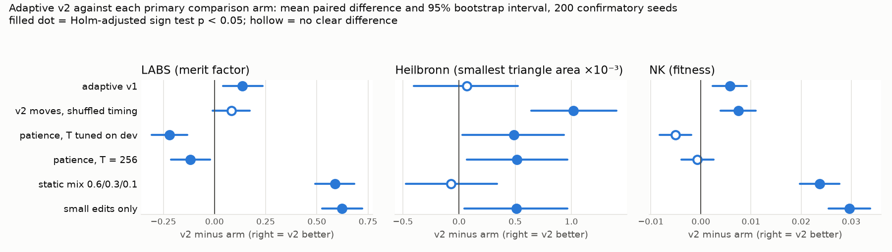

# Strategist v2: do v1's three fixes help, and does it now match a tuned patience rule?

## Question and answer

**Question.** Strategist v1 proposed three fixes for its adaptive move controller: make crossover earn
its place, cap the length of excursions, and require more evidence before leaving a leader that is still
improving. Do they make the controller better at equal cost, and does it then match a patience rule
whose threshold is tuned on development seeds?

- **The fixes help on two of three benchmarks.** On 200 confirmatory seeds, v2 beats v1 on LABS
  (+0.137 merit factor [0.043, 0.236], 110/14/76 seed wins/ties/losses, Holm p = 0.031) and NK
  (+0.00577 fitness [0.00236, 0.00915], 118/0/82, Holm p = 0.039). On Heilbronn there is no difference
  (+0.00007 [−0.00040, 0.00052], 105/0/95).
- **Most of the gain comes from the crossover gate.** Without the gate, v2 is no better than v1
  (J = +0.002, where J is the mean standardised gain over v1 across the three benchmarks); v1 with the
  gate alone gets two-thirds of v2's gain (J = +0.139 against +0.209). On LABS, removing the gate from
  v2 costs 0.182 [0.089, 0.278]. The excursion cap and the new leave test show no effect on the final
  score, alone or inside v2. Gating crossover did no better than removing it (no clear difference on
  any benchmark).
- **A patience rule tuned on dev seeds still wins on LABS, and probably on NK.** v2 minus patience_dev:
  LABS −0.220 [−0.307, −0.132] (53/15/132, Holm p = 2.3e-08); NK −0.00505 [−0.00821, −0.00189]
  (84/0/116; the interval excludes 0 but the sign test misses after Holm, p = 0.056); Heilbronn
  +0.00049 [0.00003, 0.00093] in v2's favour. The gap to patience on LABS shrank from −0.357 (v1) to
  −0.220 (v2). Across the three benchmarks v2 has the smallest worst-case gap to the best main arm
  (5.0%, against 5.3% for per-benchmark-tuned patience), which is a small margin.
- **Premature switching dropped where it could be measured.** In counterfactual forks, the share of
  switch moments where staying beat switching fell from 48% to 21% on LABS (difference −27 points,
  seed-clustered CI [−35, −17]) and from 55% to 34% on NK ([−29, −13]). On Heilbronn it stayed at
  97-98%, although v2 leaves the leader there far less often (8.4 against 26.6 times per run).

Verdict: a real but modest improvement over v1, mostly from not wasting budget on crossover. It does
not overturn v1's main negative result: on the two rugged benchmarks a simple patience rule, tuned on
separate seeds, is still better. The winner's-curse fix worked as intended: the dev estimate (J = +0.236)
fell on the validation block (+0.132) and landed at +0.209 on the confirmatory seeds, and the
patience T chosen on dev seeds held up (J = +0.384 validation, +0.381 confirmatory).

## What we did

### Code

| file | role |
|---|---|
| `strategist/controller.py` | new class `AdaptiveV2(Adaptive)`: the three fixes as options. With default options it is move-for-move identical to v1's `Adaptive` (tested). v1's code paths are unchanged. |
| `strategist/v2.py` | the experiment pipeline and CLI: dev grid, selection, freeze, validation, confirmatory run, cost sensitivity, forks, cost accounting. `python -m strategist.v2 --help` |
| `strategist/costs.py` | the move cost table as a parameter: `llm_proxy` (v1), `uniform`, a JSON file of measured costs, or an inline `edit=1,rewrite=...` string |
| `strategist/modal_app.py` | Modal fan-out (app `ssm-strategist-v2`); each job is one (benchmark, seed) with all its arms |
| `strategist/report_v2.py` | builds `tables.md`, the `headline` block of `summary.json`, `comparisons.png`, and refreshes the tables in this file |
| `strategist/forks.py` | one change: `switch_points` accepts any controller (default unchanged) |
| `strategist/stats.py` | one addition: `cluster_interval`, a bootstrap that resamples whole seeds |
| `tests/test_strategist_v2.py` | 13 tests: v1 equivalence, each option's rule, cost tables, seed blocks, determinism, summaries, report refresh |

### The three changes

- **(a) Crossover gate.** Crossover gets a sceptical prior on its success rate, wins/(pulls+1), which is
  0 before any evidence (v1 gives every move (wins+0.5)/(pulls+1)). In each context it joins the
  Thompson draw only when its posterior mean yield is at least that of the best other move. While
  locked it is probed with probability 0.02 (v2's chosen level), which is how it can earn entry.
- **(b) Excursion cap.** v1 abandons an excursion once it has stalled as long as the leader had when it
  was left. v2 caps that at 64 stalled moves.
- **(c) Recent-improvement test.** v1 leaves the leader when its expected stay yield falls below the
  explore rate. v2 also requires that the leader has gone at least 16 moves without improving.

### Setup

- Benchmarks as in v1: LABS n = 40 (merit factor), Heilbronn n = 12 (smallest triangle area), NK N = 48
  K = 6 (fitness); all higher is better. Bin packing left out: it sits at the best-fit ceiling (v1 had
  79-88% ties) and has no fresh audit in this harness.
- Budget 3,000 cost units per run; v1's proxy costs (edit 1.2, crossover 1.5, rewrite 2.0, restart
  2.0, resume 0) for the primary analysis; uniform costs as a secondary check. Every arm sees the same
  instance and starting solution for a seed.
- Seed blocks: dev 40-239, validation 240-439, confirmatory 3000-3199, forks 4000-4039. v1's blocks
  (0-39, 1000-1199, 2000-2039) were not used for any decision; the code refuses them.
- Selection (fixed before the grid ran): v2 is the configuration with the highest J among the 32 that
  switch all three changes on. J is the mean over benchmarks of the paired difference to v1 in units of
  v1's standard deviation. patience_dev is the best T per benchmark on dev seeds
  (T = 64 LABS, 512 Heilbronn, 128 NK).
- Primary endpoint: best score at the end of the budget. Six primary comparisons per benchmark, v2
  against v1, timing-shuffled v2, patience_dev, patience_256, static mix and edits only; paired over
  200 seeds; bootstrap interval of the mean, exact sign test, Holm over the six. These are the same
  statistics as v1 (`strategist/stats.py`).
- Full pre-registration, in three committed stages: [`PROTOCOL.md`](PROTOCOL.md).

### Work log

1. **Pilot** on dev seeds 40-49 (12 configurations, `dev/pilot.py`) to check that each option changes
   behaviour. Disclosed in the protocol.
2. **Bug found before any dev run: the first crossover gate never gated.** It gave untried crossover
   v1's optimistic prior, so a single failed edit made crossover look best and unlocked it. A unit test
   caught it. Fixed with the sceptical prior and a probe rate.
3. **Dead end: a realised-yield leave test.** On dev seed 41 (Heilbronn), v1 left the leader 24 of 35
   times when it had stalled for 3 moves or fewer, so the excursions that followed inherited a patience
   of 1-3 moves. Our first version of change (c) compared the leader's realised recent yield with the
   explore rate. On that seed it made things worse (302 restarts; most excursions lasted 1-3 moves), because
   the explore rate starts from the run's average progress rate, which early gains inflate. We added the
   simpler recent-improvement test and kept the yield test as a grid level; the grid chose the former.
4. **"Cap" read two ways.** We implemented both `cap` (min of inherited and cap) and `fixed` (always
   the cap) and let the dev grid choose; it chose `cap64`.
5. **Dev grid** (99 configurations, 66,000 runs, 229 s on Modal) chose `gate02/cap64/improving16`.
   The best configurations overall removed crossover instead of gating it, and the best single patience
   value (T = 128) scored higher than every adaptive configuration. Both facts were written into the
   protocol before validation.
6. **Validation** ran once; v2's J fell from +0.236 to +0.132. No change followed.
7. **Confirmatory, uniform-cost and fork runs** ran once each.
8. **After the runs (disclosed):** the fork summary was extended with tie counts and switch timing and
   recomputed from the stored moments; exploratory forks were run for each change alone; the report
   generator was written. No design, arm, seed or primary analysis changed.
9. **Reproducibility check:** 18 runs executed both on Modal (Linux) and locally (macOS) gave identical
   final scores. adaptive_v1's 697 fork moments came out identical in two separate fork runs.

## Results

All tables below are copied by `python -m strategist.v2 report` from `tables.md`, which is generated
from the saved JSON. Differences are the first arm minus the second, per seed, oriented so that
positive favours the first arm. Cells: verdict, mean [95% bootstrap interval] (wins/ties/losses,
sign-test p; Holm-adjusted in the primary table). Units: LABS merit factor, Heilbronn smallest triangle
area, NK fitness; higher is better for all three.

### v1 against v2

<!-- tables.md: v1 vs v2 -->
| | LABS | Heilbronn | NK |
|---|---|---|---|
| mean final score, v1 → v2 | 4.034 → 4.172 | 0.01043 → 0.01050 | 0.7350 → 0.7408 |
| v2 − v1, proxy costs (primary) | **better** 0.137 [0.043, 0.236] (110/14/76, p=0.031) | ~ 0.00007 [-0.00040, 0.00052] (105/0/95, p=0.87) | **better** 0.00577 [0.00236, 0.00915] (118/0/82, p=0.039) |
| v2 − v1, uniform costs (secondary) | **better** 0.166 [0.084, 0.249] (115/11/74, p=0.007) | ~ 0.00013 [-0.00034, 0.00060] (105/0/95, p=1) | ~ 0.00310 [-0.00047, 0.00660] (109/0/91, p=0.46) |
| v1 → v2, each minus patience T tuned on dev (negative = patience better) | -0.357 → -0.220 | 0.00042 → 0.00049 | -0.0108 → -0.00505 |
| crossover share of moves, v1 → v2 | 31% → 9% | 34% → 9% | 29% → 13% |
| restarts per run, v1 → v2 | 12.1 → 13.3 | 31.9 → 7.8 | 11.1 → 11.4 |
| premature share at switch points (forks), v1 → v2 | 48% → 21% (diff -27% [-35%, -17%]) | 97% → 98% (diff +0% [-3%, +3%]) | 55% → 34% (diff -21% [-29%, -13%]) |
<!-- /tables.md -->

### Primary comparisons (confirmatory seeds 3000-3199, proxy costs)



<!-- tables.md: Primary comparisons -->
| comparison | LABS | Heilbronn | NK |
|---|---|---|---|
| v2 vs adaptive v1 | **better** 0.137 [0.043, 0.236] (110/14/76, p=0.031) | ~ 0.00007 [-0.00040, 0.00052] (105/0/95, p=0.87) | **better** 0.00577 [0.00236, 0.00915] (118/0/82, p=0.039) |
| v2 vs v2 moves, shuffled timing | ~ 0.082 [-0.00882, 0.173] (104/12/84, p=0.17) | **better** 0.00102 [0.00064, 0.00140] (125/0/75, p=0.003) | **better** 0.00746 [0.00397, 0.0109] (128/0/72, p=0.00037) |
| v2 vs patience, T tuned on dev | **worse** -0.220 [-0.307, -0.132] (53/15/132, p=2.3e-08) | **better** 0.00049 [0.00003, 0.00093] (122/0/78, p=0.0091) | ~ -0.00505 [-0.00821, -0.00189] (84/0/116, p=0.056) |
| v2 vs patience, T = 256 | **worse** -0.117 [-0.212, -0.021] (76/8/116, p=0.014) | **better** 0.00052 [0.00007, 0.00096] (124/0/76, p=0.0042) | ~ -0.00070 [-0.00387, 0.00255] (101/0/99, p=0.94) |
| v2 vs static mix 0.6/0.3/0.1 | **better** 0.588 [0.492, 0.684] (157/6/37, p=4.3e-18) | ~ -0.00007 [-0.00048, 0.00034] (94/0/106, p=0.87) | **better** 0.0237 [0.0197, 0.0277] (158/0/42, p=2.6e-16) |
| v2 vs small edits only | **better** 0.623 [0.526, 0.722] (161/9/30, p=4.3e-22) | **better** 0.00051 [0.00005, 0.00096] (122/0/78, p=0.0091) | **better** 0.0297 [0.0255, 0.0338] (171/2/27, p=5.2e-26) |
<!-- /tables.md -->

Mean final scores per arm:

<!-- tables.md: Mean final score -->
| arm | LABS ↑ | Heilbronn ↑ | NK ↑ |
|---|---|---|---|
| adaptive v2 | 4.172 | 0.01050 | 0.7408 |
| adaptive v1 | 4.034 | 0.01043 | 0.7350 |
| v2 moves, shuffled timing | 4.090 | 0.00948 | 0.7333 |
| patience, T tuned on dev | 4.392 | 0.01001 | 0.7458 |
| patience, T = 256 | 4.289 | 0.00998 | 0.7415 |
| static mix 0.6/0.3/0.1 | 3.584 | 0.01057 | 0.7171 |
| small edits only | 3.549 | 0.00999 | 0.7111 |
| v1 + crossover gate only | 4.146 | 0.01044 | 0.7384 |
| v1 + excursion cap only | 4.034 | 0.01051 | 0.7358 |
| v1 + leave test only | 3.990 | 0.01034 | 0.7373 |
| v2 without crossover gate | 3.989 | 0.01040 | 0.7370 |
| v2 without excursion cap | 4.137 | 0.01042 | 0.7398 |
| v2 without leave test | 4.203 | 0.01049 | 0.7391 |
| v2 with crossover removed | 4.155 | 0.01022 | 0.7428 |
| v1 with crossover removed | 4.161 | 0.00996 | 0.7420 |
<!-- /tables.md -->

### Which change does the work (secondary, no multiplicity correction)

`only_X` is v1 plus change X alone; `without_X` is v2 with X set back to v1's behaviour.

<!-- tables.md: Secondary: which change -->
| comparison | LABS | Heilbronn | NK |
|---|---|---|---|
| only_xo vs adaptive_v1 | ~ 0.111 [0.027, 0.195] (106/13/81, p=0.079) | ~ 0.00001 [-0.00044, 0.00043] (102/0/98, p=0.83) | ~ 0.00338 [0.00008, 0.00669] (113/0/87, p=0.077) |
| adaptive_v2 vs without_xo | **better** 0.182 [0.089, 0.278] (117/8/75, p=0.003) | ~ 0.00010 [-0.00030, 0.00049] (97/0/103, p=0.72) | ~ 0.00372 [0.00008, 0.00738] (102/0/98, p=0.83) |
| only_excursion vs adaptive_v1 | ~ -0.00054 [-0.054, 0.054] (35/122/43, p=0.43) | ~ 0.00008 [-0.00011, 0.00028] (61/82/57, p=0.78) | ~ 0.00077 [-0.00109, 0.00271] (41/118/41, p=1) |
| adaptive_v2 vs without_excursion | ~ 0.035 [-0.027, 0.101] (60/91/49, p=0.34) | ~ 0.00008 [-0.00009, 0.00025] (59/101/40, p=0.07) | ~ 0.00098 [-0.00108, 0.00306] (42/112/46, p=0.75) |
| only_leave vs adaptive_v1 | ~ -0.045 [-0.128, 0.039] (83/41/76, p=0.63) | ~ -0.00009 [-0.00048, 0.00030] (91/9/100, p=0.56) | ~ 0.00231 [-0.00116, 0.00579] (102/11/87, p=0.31) |
| adaptive_v2 vs without_leave | ~ -0.031 [-0.130, 0.068] (89/21/90, p=1) | ~ 0.00000 [-0.00043, 0.00044] (95/1/104, p=0.57) | ~ 0.00167 [-0.00155, 0.00499] (99/5/96, p=0.89) |

| comparison | LABS | Heilbronn | NK |
|---|---|---|---|
| v2 vs v2 with crossover removed | ~ 0.016 [-0.076, 0.112] (96/12/92, p=0.83) | ~ 0.00027 [-0.00011, 0.00066] (110/0/90, p=0.18) | ~ -0.00208 [-0.00539, 0.00125] (91/0/109, p=0.23) |
| v2 vs v1 with crossover removed | ~ 0.011 [-0.074, 0.098] (91/13/96, p=0.77) | **better** 0.00054 [0.00010, 0.00097] (115/0/85, p=0.04) | ~ -0.00127 [-0.00459, 0.00205] (94/0/106, p=0.44) |
<!-- /tables.md -->

### Counterfactual forks (seeds 4000-4039)

At each moment the controller leaves the leader, the state is copied; 20 forks follow the controller
and 20 stay with small edits, for 300 cost units. Up to 6 moments per seed. "Premature share" is the
fraction of moments where staying gave the larger mean gain. Intervals resample seeds, not moments.

<!-- tables.md: Counterfactual forks -->
| benchmark | controller | leaves per run | switch moments | stall at switch (mean) | P(new best) switch / stay | mean gain switch / stay | gain switch − stay [seed-clustered CI] | stay better / switch better / tie | premature share [seed-clustered CI] | premature share excl. ties |
|---|---|---|---|---|---|---|---|---|---|---|
| LABS | adaptive v1 | 10.8 | 228 | 113 | 54.9% / 52.6% | 0.422 / 0.501 | -0.080 [-0.114, -0.045] | 109 / 76 / 43 | 48% [40%, 55%] | 59% |
| LABS | adaptive v2 | 13.2 | 240 | 188 | 30.7% / 27.5% | 0.180 / 0.195 | -0.014 [-0.056, 0.025] | 51 / 122 / 67 | 21% [15%, 28%] | 29% |
| Heilbronn | adaptive v1 | 26.6 | 234 | 27 | 82.5% / 99.9% | 0.00103 / 0.00221 | -0.00118 [-0.00129, -0.00107] | 228 / 6 / 0 | 97% [95%, 100%] | 97% |
| Heilbronn | adaptive v2 | 8.4 | 224 | 40 | 70.9% / 99.9% | 0.00080 / 0.00207 | -0.00128 [-0.00146, -0.00111] | 219 / 5 / 0 | 98% [95%, 100%] | 98% |
| NK | adaptive v1 | 9.5 | 235 | 105 | 60.6% / 60.0% | 0.0322 / 0.0406 | -0.00836 [-0.0102, -0.00643] | 129 / 59 / 47 | 55% [49%, 60%] | 69% |
| NK | adaptive v2 | 11.2 | 237 | 152 | 38.9% / 40.0% | 0.0128 / 0.0160 | -0.00311 [-0.00487, -0.00142] | 80 / 98 / 59 | 34% [28%, 40%] | 45% |

| benchmark | controller − v1 | premature share [CI] | gain difference [CI] | leaves per run |
|---|---|---|---|---|
| LABS | adaptive v2 | -27% [-35%, -17%] | 0.065 [0.016, 0.113] | +2.4 |
| Heilbronn | adaptive v2 | +0% [-3%, +3%] | -0.00010 [-0.00032, 0.00011] | -18.2 |
| NK | adaptive v2 | -21% [-29%, -13%] | 0.00525 [0.00271, 0.00778] | +1.8 |
<!-- /tables.md -->

Exploratory, not pre-registered: the same forks for each change alone. On LABS the leave test gives
the largest single drop in premature switching (−15 points of v2's −27); on NK no single change
explains v2's drop.

<!-- tables.md: Exploratory -->
| benchmark | controller | leaves per run | switch moments | stall at switch (mean) | P(new best) switch / stay | mean gain switch / stay | gain switch − stay [seed-clustered CI] | stay better / switch better / tie | premature share [seed-clustered CI] | premature share excl. ties |
|---|---|---|---|---|---|---|---|---|---|---|
| LABS | adaptive v1 | 10.8 | 228 | 113 | 54.9% / 52.6% | 0.422 / 0.501 | -0.080 [-0.114, -0.045] | 109 / 76 / 43 | 48% [40%, 55%] | 59% |
| LABS | v1 + crossover gate only | 14.9 | 238 | 98 | 54.3% / 51.7% | 0.434 / 0.510 | -0.076 [-0.110, -0.041] | 109 / 98 / 31 | 46% [39%, 52%] | 53% |
| LABS | v1 + excursion cap only | 13.9 | 235 | 170 | 46.3% / 44.6% | 0.354 / 0.422 | -0.069 [-0.103, -0.035] | 95 / 87 / 53 | 40% [33%, 47%] | 52% |
| LABS | v1 + leave test only | 7.8 | 210 | 141 | 40.7% / 37.1% | 0.259 / 0.303 | -0.044 [-0.077, -0.013] | 68 / 90 / 52 | 32% [26%, 39%] | 43% |
| Heilbronn | adaptive v1 | 26.6 | 234 | 27 | 82.5% / 99.9% | 0.00103 / 0.00221 | -0.00118 [-0.00129, -0.00107] | 228 / 6 / 0 | 97% [95%, 100%] | 97% |
| Heilbronn | v1 + crossover gate only | 38.4 | 240 | 22 | 80.3% / 99.9% | 0.00109 / 0.00238 | -0.00129 [-0.00146, -0.00113] | 227 / 13 / 0 | 95% [90%, 98%] | 95% |
| Heilbronn | v1 + excursion cap only | 29.5 | 235 | 25 | 84.1% / 99.9% | 0.00099 / 0.00212 | -0.00113 [-0.00125, -0.00101] | 229 / 6 / 0 | 97% [95%, 100%] | 97% |
| Heilbronn | v1 + leave test only | 6.6 | 208 | 45 | 69.4% / 99.6% | 0.00076 / 0.00206 | -0.00131 [-0.00143, -0.00119] | 204 / 4 / 0 | 98% [95%, 100%] | 98% |
| NK | adaptive v1 | 9.5 | 235 | 105 | 60.6% / 60.0% | 0.0322 / 0.0406 | -0.00836 [-0.0102, -0.00643] | 129 / 59 / 47 | 55% [49%, 60%] | 69% |
| NK | v1 + crossover gate only | 13.8 | 237 | 77 | 64.0% / 66.6% | 0.0404 / 0.0492 | -0.00875 [-0.0106, -0.00696] | 144 / 65 / 28 | 61% [55%, 66%] | 69% |
| NK | v1 + excursion cap only | 11.9 | 239 | 147 | 52.8% / 53.5% | 0.0284 / 0.0357 | -0.00729 [-0.00900, -0.00552] | 119 / 48 / 72 | 50% [44%, 56%] | 71% |
| NK | v1 + leave test only | 6.2 | 207 | 131 | 46.9% / 51.6% | 0.0159 / 0.0220 | -0.00617 [-0.00791, -0.00450] | 98 / 64 / 45 | 47% [41%, 54%] | 60% |

| benchmark | controller − v1 | premature share [CI] | gain difference [CI] | leaves per run |
|---|---|---|---|---|
| LABS | v1 + crossover gate only | -2% [-11%, +7%] | 0.00405 [-0.038, 0.044] | +4.1 |
| LABS | v1 + excursion cap only | -7% [-12%, -3%] | 0.011 [-0.00823, 0.029] | +3.2 |
| LABS | v1 + leave test only | -15% [-22%, -9%] | 0.036 [-0.00053, 0.069] | -3.0 |
| Heilbronn | v1 + crossover gate only | -3% [-6%, -0%] | -0.00011 [-0.00032, 0.00010] | +11.8 |
| Heilbronn | v1 + excursion cap only | +0% [+0%, +0%] | 0.00005 [-0.00000, 0.00011] | +2.9 |
| Heilbronn | v1 + leave test only | +1% [-3%, +4%] | -0.00013 [-0.00028, 0.00002] | -20.0 |
| NK | v1 + crossover gate only | +6% [-2%, +14%] | -0.00039 [-0.00275, 0.00188] | +4.3 |
| NK | v1 + excursion cap only | -5% [-9%, -1%] | 0.00107 [0.00006, 0.00187] | +2.5 |
| NK | v1 + leave test only | -8% [-16%, +1%] | 0.00219 [0.00018, 0.00414] | -3.3 |
<!-- /tables.md -->

### Winner's curse: dev, validation and confirmatory estimates

<!-- tables.md: Winner's curse -->
| comparison | block | LABS | Heilbronn | NK |
|---|---|---|---|---|
| v2 − adaptive v1 | dev 40-239 | 0.136 [0.043, 0.230] | 0.00011 [-0.00033, 0.00055] | 0.00695 [0.00365, 0.0103] |
| v2 − adaptive v1 | validation 240-439 | 0.101 [0.00115, 0.201] | 0.00017 [-0.00026, 0.00059] | 0.00230 [-0.00147, 0.00599] |
| v2 − adaptive v1 | confirmatory 3000-3199 | 0.137 [0.043, 0.236] | 0.00007 [-0.00040, 0.00052] | 0.00577 [0.00236, 0.00915] |
| v2 − patience, T tuned on dev | dev 40-239 | -0.269 [-0.355, -0.183] | 0.00074 [0.00029, 0.00120] | -0.00846 [-0.0116, -0.00528] |
| v2 − patience, T tuned on dev | validation 240-439 | -0.305 [-0.388, -0.218] | 0.00059 [0.00011, 0.00108] | -0.00751 [-0.0107, -0.00428] |
| v2 − patience, T tuned on dev | confirmatory 3000-3199 | -0.220 [-0.307, -0.132] | 0.00049 [0.00003, 0.00093] | -0.00505 [-0.00821, -0.00189] |

| arm | J validation | J confirmatory |
|---|---|---|
| adaptive v2 | +0.132 | +0.209 |
| patience, T tuned on dev | +0.384 | +0.381 |
| patience, T = 256 | +0.205 | +0.228 |
| static mix 0.6/0.3/0.1 | -0.514 | -0.615 |
| small edits only | -0.827 | -0.831 |
| v1 + crossover gate only | +0.058 | +0.139 |
| v1 + excursion cap only | +0.022 | +0.025 |
| v1 + leave test only | -0.051 | -0.002 |
| v2 without crossover gate | -0.029 | +0.002 |
| v2 without excursion cap | +0.103 | +0.156 |
| v2 without leave test | +0.092 | +0.200 |
| v2 with crossover removed | +0.244 | +0.195 |
| v1 with crossover removed | +0.035 | +0.146 |

J = mean over benchmarks of the paired difference to adaptive v1 in units of v1's SD. Dev J of the chosen design: +0.236.
<!-- /tables.md -->

### Cost sensitivity: uniform move costs (secondary)

Same frozen controller; patience T re-tuned on dev seeds under uniform costs (it came out the same).

<!-- tables.md: Cost sensitivity: `uniform` -->
| arm | LABS ↑ | Heilbronn ↑ | NK ↑ |
|---|---|---|---|
| adaptive v2 | 4.112 | 0.01176 | 0.7391 |
| adaptive v1 | 3.946 | 0.01162 | 0.7360 |
| patience, T tuned on dev | 4.439 | 0.01054 | 0.7477 |
| patience, T = 256 | 4.348 | 0.01052 | 0.7446 |
| static mix 0.6/0.3/0.1 | 3.617 | 0.01174 | 0.7177 |
| small edits only | 3.549 | 0.01049 | 0.7111 |

| comparison | LABS | Heilbronn | NK |
|---|---|---|---|
| v2 vs adaptive v1 | **better** 0.166 [0.084, 0.249] (115/11/74, p=0.007) | ~ 0.00013 [-0.00034, 0.00060] (105/0/95, p=1) | ~ 0.00310 [-0.00047, 0.00660] (109/0/91, p=0.46) |
| v2 vs v2 moves, shuffled timing | ~ 0.00659 [-0.078, 0.089] (99/9/92, p=0.66) | ~ 0.00079 [0.00032, 0.00124] (116/0/84, p=0.084) | ~ 0.00228 [-0.00114, 0.00557] (109/0/91, p=0.46) |
| v2 vs patience, T tuned on dev | **worse** -0.327 [-0.413, -0.244] (54/8/138, p=4.6e-09) | **better** 0.00122 [0.00076, 0.00169] (132/0/68, p=2.8e-05) | **worse** -0.00856 [-0.0119, -0.00538] (77/0/123, p=0.0056) |
| v2 vs patience, T = 256 | **worse** -0.236 [-0.328, -0.146] (72/10/118, p=0.0031) | **better** 0.00124 [0.00077, 0.00169] (133/0/67, p=2.1e-05) | **worse** -0.00549 [-0.00861, -0.00234] (80/0/120, p=0.017) |
| v2 vs static mix 0.6/0.3/0.1 | **better** 0.495 [0.407, 0.583] (153/8/39, p=1.8e-16) | ~ 0.00002 [-0.00041, 0.00044] (99/0/101, p=1) | **better** 0.0214 [0.0171, 0.0255] (150/0/50, p=4.2e-12) |
| v2 vs small edits only | **better** 0.563 [0.464, 0.660] (163/6/31, p=4.7e-22) | **better** 0.00127 [0.00080, 0.00173] (133/0/67, p=2.1e-05) | **better** 0.0280 [0.0239, 0.0321] (160/0/40, p=2e-17) |

| comparison | LABS | Heilbronn | NK |
|---|---|---|---|
| only_xo vs adaptive_v1 | **better** 0.165 [0.081, 0.248] (124/4/72, p=0.00025) | ~ -0.00013 [-0.00059, 0.00032] (101/0/99, p=0.94) | ~ 0.00402 [0.00038, 0.00773] (107/0/93, p=0.36) |
| only_excursion vs adaptive_v1 | ~ 0.00996 [-0.042, 0.063] (45/104/51, p=0.61) | ~ 0.00006 [-0.00018, 0.00030] (71/69/60, p=0.38) | ~ -0.00098 [-0.00317, 0.00116] (40/115/45, p=0.66) |
| only_leave vs adaptive_v1 | ~ 0.049 [-0.028, 0.130] (83/38/79, p=0.81) | ~ -0.00006 [-0.00049, 0.00038] (93/6/101, p=0.62) | ~ -0.00045 [-0.00369, 0.00277] (97/15/88, p=0.56) |
<!-- /tables.md -->

### Robustness and anytime performance

<!-- tables.md: Robustness -->
| arm | LABS | Heilbronn | NK | worst case |
|---|---|---|---|---|
| adaptive v2 | −5.0% | −0.7% | −0.7% | 5.0% |
| patience, T tuned on dev | 0% | −5.3% | 0% | 5.3% |
| patience, T = 256 | −2.3% | −5.6% | −0.6% | 5.6% |
| adaptive v1 | −8.1% | −1.3% | −1.5% | 8.1% |
| static mix 0.6/0.3/0.1 | −18.4% | 0% | −3.9% | 18.4% |
| small edits only | −19.2% | −5.5% | −4.7% | 19.2% |
<!-- /tables.md -->

<!-- tables.md: Anytime performance -->
| comparison | LABS | Heilbronn | NK |
|---|---|---|---|
| v2 vs adaptive v1 | **better** 0.109 [0.031, 0.189] (122/0/78, p=0.0068) | ~ 0.00001 [-0.00032, 0.00033] (104/0/96, p=1) | ~ 0.00516 [0.00237, 0.00796] (112/0/88, p=0.21) |
| v2 vs v2 moves, shuffled timing | ~ 0.077 [0.00199, 0.151] (110/0/90, p=0.36) | ~ 0.00029 [0.00003, 0.00057] (107/0/93, p=1) | **better** 0.00725 [0.00407, 0.0104] (126/0/74, p=0.0012) |
| v2 vs patience, T tuned on dev | **worse** -0.175 [-0.244, -0.106] (67/0/133, p=1.4e-05) | ~ 0.00022 [-0.00013, 0.00057] (108/0/92, p=1) | ~ -0.00570 [-0.00834, -0.00299] (83/0/117, p=0.058) |
| v2 vs patience, T = 256 | ~ -0.067 [-0.142, 0.00911] (94/0/106, p=0.44) | ~ 0.00023 [-0.00011, 0.00058] (107/0/93, p=1) | ~ -0.00140 [-0.00405, 0.00132] (94/0/106, p=0.44) |
| v2 vs static mix 0.6/0.3/0.1 | **better** 0.382 [0.299, 0.468] (145/0/55, p=7.6e-10) | **worse** -0.00037 [-0.00067, -0.00007] (80/0/120, p=0.034) | **better** 0.0148 [0.0112, 0.0184] (141/0/59, p=3.2e-08) |
| v2 vs small edits only | **better** 0.362 [0.272, 0.450] (148/0/52, p=4.4e-11) | ~ 0.00022 [-0.00013, 0.00057] (108/0/92, p=1) | **better** 0.0163 [0.0126, 0.0201] (148/0/52, p=4.4e-11) |
<!-- /tables.md -->

### v1 on new seeds (replication of v1's findings)

<!-- tables.md: Secondary: v1 on new seeds -->
| comparison | LABS | Heilbronn | NK |
|---|---|---|---|
| adaptive_v1 vs patience_dev | **worse** -0.357 [-0.444, -0.273] (49/9/142, p=1.1e-11) | ~ 0.00042 [-0.00003, 0.00088] (109/0/91, p=0.23) | **worse** -0.0108 [-0.0139, -0.00782] (59/0/141, p=6.3e-09) |
| adaptive_v1 vs patience_256 | **worse** -0.255 [-0.350, -0.160] (58/14/128, p=3.1e-07) | ~ 0.00045 [-0.00001, 0.00090] (107/0/93, p=0.36) | **worse** -0.00647 [-0.00977, -0.00316] (85/0/115, p=0.04) |
| adaptive_v1 vs static_mix | **better** 0.451 [0.361, 0.540] (156/12/32, p=8.8e-21) | ~ -0.00014 [-0.00057, 0.00031] (109/0/91, p=0.23) | **better** 0.0179 [0.0138, 0.0221] (133/0/67, p=3.5e-06) |
| adaptive_v1 vs edits_only | **better** 0.486 [0.382, 0.588] (145/11/44, p=8.6e-14) | ~ 0.00044 [-0.00001, 0.00090] (109/0/91, p=0.23) | **better** 0.0239 [0.0197, 0.0281] (160/0/40, p=3.4e-18) |
<!-- /tables.md -->

### Move usage

<!-- tables.md: Move usage -->
| | LABS v1 | LABS v2 | Heilbronn v1 | Heilbronn v2 | NK v1 | NK v2 |
|---|---|---|---|---|---|---|
| edit share | 50.2% | 69.4% | 46.3% | 61.5% | 54.7% | 69.4% |
| rewrite share | 17.8% | 20.1% | 16.8% | 28.4% | 15.5% | 16.6% |
| crossover share | 31.0% | 9.4% | 34.0% | 9.5% | 28.8% | 13.0% |
| restart share | 0.6% | 0.6% | 1.5% | 0.4% | 0.5% | 0.5% |
| restarts per run | 12.1 | 13.3 | 31.9 | 7.8 | 11.1 | 11.4 |
<!-- /tables.md -->

## What it means

- **Most of v1's waste was crossover.** v1 spent about 30% of its moves on crossover: with an
  optimistic prior and Thompson sampling in every context, it kept trying it. The sceptical gate cuts
  that to 9-13%. v1 with the gate alone ends up close to v1 with crossover removed (mean merit factor
  4.146 and 4.161 on LABS; fitness 0.7384 and 0.7420 on NK). Inside v2, gating crossover and removing
  it are not clearly different on any benchmark.
- **Leaving later reduces premature switches but does not raise the final score.** v2's switch moments
  come later and at longer stalls (mean stall 188 against 113 on LABS), and staying wins at far fewer of
  them. But the leave test alone and the excursion cap alone do not move the final score, and v2 without
  the leave test is not worse than v2. On these benchmarks, switching earlier or later within this range
  costs little over a full 3,000-unit run.
- **Heilbronn is different.** Edits keep improving a Heilbronn leader for a long time (99.9% of stay
  forks found a new best), so almost any switch looks premature over 300 units. Yet adaptive timing
  still pays over a whole run there: v2 beats its own moves in shuffled order by +0.00102 and beats
  both patience rules.
- **The timing result holds on two of three benchmarks.** v2 beats the timing-shuffled replay of its own
  moves on Heilbronn and NK (Holm p = 0.003 and 0.00037). On LABS, as in v1, there is no clear effect
  of order (+0.082 [−0.009, 0.173]).
- **The protocol did its job.** Dev seeds overstated v2's advantage (J +0.236 against +0.132 on
  validation), and the validation block flagged it before the confirmatory run. The per-benchmark
  patience T chosen on dev seeds generalised almost exactly. In v1 it was chosen on the confirmatory
  seeds, so v1's "patience wins" result now holds without that bias.

## What it does not show

- **Not an LLM result.** Moves are stochastic local operators and costs are a proxy table; no LLM was
  called. The measured-cost re-run is ready but waits for measured ratios (see Next steps).
- **The patience baseline is tuned per benchmark; v2 is one design for all three.** That favours
  patience. A single T across benchmarks (T = 128, chosen on dev) was recorded but is not a
  confirmatory arm.
- **The leave test and cap may matter at other budgets.** One budget (3,000 units) and one problem
  size per benchmark. Premature switching may cost more with a smaller budget.
- **Forks use a 300-unit window** and moments that come later in v2's runs than in v1's. The
  premature share compares the moments each controller chose. It does not compare the same moments.
- **Secondary and exploratory comparisons are uncorrected.** Only the six primary comparisons per
  benchmark are Holm-corrected; the ablations and forks are not.
- **Same instances for every LABS and Heilbronn seed.** As in v1, only the start and the random
  streams change with the seed on those two benchmarks; NK draws a new instance per seed.

## Related work

Adaptive restarting during a run is not new. AdaEvolve (Cemri et al. 2026,
[arXiv:2602.20133](https://arxiv.org/abs/2602.20133)) keeps a decayed improvement signal per island and
opens a new island when all have stalled. PACEvolve (Yan et al. 2026,
[arXiv:2601.10657](https://arxiv.org/abs/2601.10657)) uses a momentum signal to choose between
backtracking and crossover. MetaMax (György & Kocsis 2011,
[arXiv:1401.3894](https://arxiv.org/abs/1401.3894)) decides between continuing runs and starting new
ones, and Luby restarts (Luby, Sinclair & Zuckerman 1993) give a universal restart schedule that needs no
tuning. What we have not found in that work is a leave rule that weighs each move's expected yield by
its cost, or controls that separate switch timing from move mix (the timing-shuffled replay) and test
whether switches cause the progress that follows (counterfactual forks). Only those are claimed as new
here. MetaMax and Luby restarts are untuned baselines that this experiment did not include.

## Cost

| item | amount |
|---|---|
| Anthropic API | $0 (no LLM calls; no `usage.jsonl`) |
| Modal (app `ssm-strategist-v2`, 8 app runs) | $0.33, from `modal billing report --for today` (in `cost.json`) |
| Wall time on Modal | about 8 minutes of jobs: dev 229 s, uniform dev 22 s, validation 35 s, confirmatory 34 s, uniform confirmatory 42 s, forks 32 s, exploratory forks 83 s |
| Search runs | 98,400 runs, 14,176 CPU-seconds in total |
| Evaluator executions | 223,656,370 in the runs, plus about 39 million in forks (estimated: fork evaluations are not logged) |
| Local compute | tests, the pilot (2 processes) and report generation |

## Reproduce

From the repository root (the CLI also runs without `--modal`, on at most 2 local processes):

```sh
python -m pytest tests/test_strategist_v2.py tests/test_strategist.py -q
python -m strategist.v2 dev --modal        # dev grid -> dev/selection.json
python -m strategist.v2 freeze             # -> frozen.json
python -m strategist.v2 validate --modal --force   # --force: it refuses to re-run a run-once phase
python -m strategist.v2 confirm --modal --force
python -m strategist.v2 confirm --costs uniform --modal --force
python -m strategist.v2 forks --modal
python -m strategist.v2 forks --modal --controllers only_xo,only_excursion,only_leave --out forks_ablations.json
python -m strategist.v2 report             # tables.md, summary.json headline, figure, tables here
python -m strategist.v2 cost               # cost.json
```

**Measured LLM costs, when available.** Fill in the four relative costs in
`experiments/strategist-v2/costs/measured_llm.json` (or pass them inline), then run one command:

```sh
python -m strategist.v2 confirm --costs measured --modal
# or: ... confirm --costs edit=1,rewrite=3.1,crossover=2.4,restart=3.5 --modal
```

It re-tunes the patience baseline on the dev seeds under the new table, runs every arm on the
confirmatory seeds with the frozen v2 controller, writes `costs/measured_llm-<hash>/`, and refreshes
`tables.md` and the tables in this file. Costs are rescaled so an edit costs 1.2, as in the proxy table.

## Evidence index

| file | contents |
|---|---|
| `RESULTS.md` | this write-up |
| `PROTOCOL.md` | pre-registration in three committed stages, plus disclosed changes |
| `summary.json` | `headline` (machine-readable headline numbers and spend), then the full confirmatory summary per benchmark: arm statistics, all comparisons, curves, move usage |
| `runs.jsonl.gz` | every confirmatory run (200 seeds × 3 benchmarks × 15 arms): final score, 30-point curve, move counts, per-context usage for v1 and v2 |
| `forks.json` | pre-registered forks for v1 and v2: config, summary, every switch moment |
| `forks_ablations.json` | exploratory forks for each change alone (and v1 again) |
| `tables.md` | every table, generated from the JSON |
| `comparisons.png` | figure: v2 minus each primary arm with 95% intervals |
| `frozen.json` | the frozen design, patience T per benchmark, source hashes at freeze time |
| `cost.json` | Modal spend, run and evaluation counts |
| `confirm.log`, `forks.log`, `forks_ablations.log` | console output of those runs |
| `dev/runs.jsonl.gz` | all 66,000 dev-grid runs (final score and move counts) |
| `dev/selection.json` | the selection rule, J for every configuration, patience means |
| `dev/dev.log`, `dev/pilot.py` | dev console output; the pilot script |
| `validation/` | the one-time validation run: `runs.jsonl.gz`, `summary.json` (with J per arm), log |
| `costs/uniform/` | uniform-cost run: dev patience re-tuning (`dev_runs.jsonl.gz`, `dev_selection.json`), `runs.jsonl.gz`, `summary.json`, log |
| `costs/measured_llm.json` | placeholder for measured LLM move costs, with the re-run command |

Every config records the arguments, cost table, seeds, the sha256 of each `strategist/*.py` file and the
Python version.

## Next steps

1. **Run the measured LLM cost table** as soon as the LLM experiments report token costs per move type
   (one command, above).
2. **Add untuned restart baselines** (Luby, MetaMax). They answer the tuning objection better than a
   patience rule tuned per benchmark.
3. **Test a single cross-benchmark patience value** (T = 128 from dev) as a confirmatory arm on new
   seeds. If it also beats v2, the honest default for the framework is a fixed patience rule plus the
   crossover gate.
4. **Vary the budget** (e.g. 1,000 and 10,000 units), where the cost of premature switching may differ.
5. **Fix the explore-rate prior.** It starts from the run's average progress rate, which early gains
   inflate. This is behind v1's occasional one-move excursion cascades.

## Suggested README text

For `strategist/README.md` (not edited here):

> ### v2 (experiments/strategist-v2)
>
> v1's three proposed fixes were tested as a new pre-registered experiment: a crossover gate, an
> excursion cap and a recent-improvement test before leaving the leader (`AdaptiveV2` in
> `controller.py`; the defaults reproduce v1 exactly). The design was chosen on 200 dev seeds, checked
> once on 200 validation seeds, and confirmed once on 200 new seeds.
>
> v2 beats v1 on LABS (+0.137 merit factor) and NK (+0.00577 fitness) and ties on Heilbronn. Nearly all
> of the gain comes from the crossover gate. Premature switching fell from 48% to 21% of switch points
> on LABS and from 55% to 34% on NK. A patience rule tuned on dev seeds still beats v2 on LABS and,
> weakly, on NK. Run it with `python -m strategist.v2 --help`; the cost table is a parameter
> (`--costs uniform`, `--costs measured`, or inline `edit=1,rewrite=...`).
