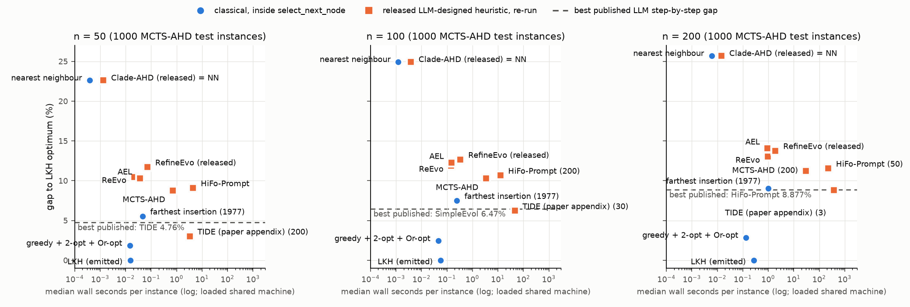

# tsp-construct-v1: textbook heuristics from 1958–1977 beat the LLM-designed step-by-step TSP heuristics inside their own interface

**Question.** More than a dozen LLM-based automatic heuristic design (AHD) papers report progress on
the "step-by-step construction" TSP task. They include AEL, ReEvo, EoH, MCTS-AHD, CALM, MoH,
HiFo-Prompt, Clade-AHD, PathWise, TIDE and SimpleEvol. An LLM writes `select_next_node(current_node,
destination_node, unvisited_nodes, distance_matrix)`, and the tour is built by appending its answers.
On random instances their only hand-designed baseline is nearest neighbour. We asked three things:
- How do textbook TSP heuristics compare on the same instances, inside the same interface?
- What does the compute behind the LLM-designed heuristics buy?
- Is the benchmark's reference sound?

**Answer.** The interface hands every call the whole distance matrix, so a function whose output
depends only on its four arguments can compute a complete tour and emit it one node at a time. The
benchmark's ceiling is therefore the optimum, and classical methods reach it cheaply. All numbers
below are from the pre-registered confirmatory run on MCTS-AHD's released 1,000-instance test sets
(`tables.md`). Gaps are above the LKH reference.

| | n = 50 | n = 100 | n = 200 |
|---|---|---|---|
| **Greedy edge + 2-opt + Or-opt, emitted** (about 100 lines of numpy) | **1.85%** (0.015 s; uncached 0.35 s) | **2.44%** (0.045 s; uncached 2.1 s) | **2.85%** (0.13 s; uncached 11.7 s) |
| **Farthest insertion (1977), emitted** (no cache) | 5.53% (0.046 s) | 7.49% (0.24 s) | 9.03% (1.0 s) |
| LKH tour, emitted (ceiling) | 0.00% (0.015 s; uncached 0.35 s) | 0.00% (0.056 s; uncached 3.4 s) | 0.00% (0.27 s; uncached 47 s) |
| Best published LLM step-by-step result | 4.76% (TIDE) | 6.47% (SimpleEvol) | 8.88% (HiFo-Prompt) |
| MCTS-AHD Table 1, GPT-4o-mini | 9.69% | 11.79% | 13.71% (13.19% against our reference) |
| Released MCTS-AHD heuristic, re-run | 8.78% (0.72 s) | 10.30% (3.5 s) | 11.25% (30 s; 200 instances) |
| Released HiFo-Prompt heuristic, re-run | 9.09% (4.4 s) | 10.66% (12 s; 200 instances) | 11.55% (225 s; 50 instances) |
| TIDE's appendix heuristic, transcribed (exploratory) | 3.02% (3.3 s; 200 instances) | 6.21% (46 s; 30 instances) | 8.83% (376 s; 3 instances) |
| Nearest neighbour (the papers' baseline) | 22.62% | 24.94% | 25.71% (26.29% against 10.659) |

Times are median wall seconds per instance on a shared, loaded laptop; read them as orders of
magnitude.

**About the cache.** `greedy_ls_emit` and `lkh_emit` keep the plan in a module-level cache keyed on
the matrix bytes. The plan is recomputed only when a new instance arrives. This changes speed, not
answers: the uncached variants (`heuristics/*_nocache.py`) give identical tour lengths (maximum difference 0.0 on 1,000 / 200 / 50 instances at n = 50 / 100 / 200; `results/nocache_summary.json`). MCTS-AHD's
evaluation imports the function once per process, so the cache is allowed by the harness. Some readers
will see it as state, so both times are reported. `fi_emit` has no cache. Without the cache, emitting
costs about n times the planning time per instance; the speed and dominance statements below say
which version they use.

- **H1 holds at every n.** Greedy edge + 2-opt + Or-opt, emitted through `select_next_node`, is below
  every published result for the step-by-step task. (RedAHD, which drops the per-step interface and
  writes whole-route functions with 2-opt, reports 1.62% at n = 50 on the same instances.) It is also
  below the following:
  - RefineEvo's Claude Opus objectives, an inferred ≈3.3% at n = 100 and ≈4.7% at n = 200;
  - TIDE's own heuristic re-run on the same instances: 1.85% against 3.02% at n = 50, and 27 of 30
    wins at n = 100.

  With its cache it is about 50–2,800× faster than the rollout-based LLM heuristics (MCTS-AHD,
  HiFo-Prompt, TIDE); without it (0.35 / 2.1 / 11.7 s per instance), it is still 1.7–32× faster than all three: 2.0 / 1.7 / 2.5× faster than MCTS-AHD at n = 50 / 100 / 200.
- **H3 holds at every n.** Farthest insertion (Rosenkrantz, Stearns and Lewis 1977), with no local
  search and no cache, is below every LLM-AHD row of MCTS-AHD's Table 1 and of CALM, MoH, Clade-AHD
  and PathWise at all three sizes. Those tables also list POMO, a trained neural solver (0.39% and
  3.01% at n = 50 and 100), which is not an LLM-AHD method and is not part of H3.
  - Its paired difference against the re-run MCTS-AHD, ReEvo and AEL heuristics is negative with the
    95% CI below 0 at each n. At n = 50, for example: −0.184 per instance [−0.202, −0.167] against
    MCTS-AHD, 735 wins and 265 losses.
  - Even nearest neighbour + plain 2-opt (5.88 / 6.94 / 7.75%) beats every LLM-AHD row of the
    MCTS-AHD lineage.
- **The pre-registered H2 fails, because of one heuristic.** H2 required every re-run released
  heuristic to be dominated. It holds for 5 of the 6: MCTS-AHD, HiFo-Prompt, ReEvo, AEL and RefineEvo's
  file. Each is beaten by an interface method with shorter tours on 96–100% of instances and no more
  time per instance.
  - For ReEvo and AEL the dominating method is the cached `greedy_ls_emit`. Without the cache,
    ReEvo and AEL (0.02–0.96 s per instance) are faster than any uncached method we ran that beats
    them, so for those two H2 rests on the cache. MCTS-AHD, HiFo-Prompt and RefineEvo's file remain
    dominated without it, by farthest insertion, which has no cache. For the two rollout heuristics,
    uncached greedy + 2-opt + Or-opt also dominates them.
  - The exception is Clade-AHD's released `gpt.py`, which builds *exactly* the nearest-neighbour
    tour on every instance: its score is 0.5d − 1/(d + 1e-5) plus a constant, which increases with
    d. Nothing can be strictly faster and shorter than it.
  - TIDE's appendix heuristic (exploratory) is also dominated at the sizes we could afford to run:
    200, 30 and 3 instances. It is about 220–2,800× slower than greedy + 2-opt + Or-opt and has
    longer tours: greedy − TIDE at n = 50 is −0.060 per instance [−0.087, −0.034] (125 wins, 2
    ties, 73 losses).
  - The transcribed TIDE heuristic scores better than TIDE's published numbers (3.02 / 6.21 / 8.83%
    against 4.76 / 7.15 / 10.65%). The published numbers are a mean of three runs and the appendix
    shows the best-performing heuristic, which may explain it; our n = 100 and 200 samples are small.
- **H4 holds.** On fresh instances from our own seeds (1,000 / 1,000 / 200), all 54 pre-registered
  paired comparisons keep their sign. Six of them are the exact ties between nearest neighbour and
  Clade-AHD's file.
  - Gaps on the fresh sets: greedy + 2-opt + Or-opt 1.93 / 2.52 / 2.82%, farthest insertion 5.59 /
    7.54 / 9.12%.
  - MCTS-AHD 9.39 / 10.57 / 10.73% and HiFo-Prompt 9.75 / 11.13 / 12.02%, both on prefixes.
- **MCTS-AHD's n = 200 reference is too low.** Its published n = 200 "Optimal" is 10.659. Our LKH
  mean on its own released test200 is **10.708**, and the evidence says this is the optimum:
  - MCTS-AHD's heavier LKH setting found no shorter tour on 20 of 20 instances;
  - an integer program proved our tour optimal on 5 of 5 instances;
  - PathWise independently reports 10.709 on its own 250 instances;
  - the instances are the same: our nearest neighbour reproduces their published 13.461 exactly.

  Gaps computed against 10.659 are therefore overstated by about 0.5 points: MCTS-AHD's 13.71% is
  13.19%. SimpleEvol and CALM print 10.659 as their reference, and Clade-AHD's n = 200 numbers imply
  it (11.864 → 11.30%). TIDE uses MCTS-AHD's sets only at n = 50. At n = 50 and 100 the published
  references (5.675, 7.768) match ours.
- **Behavioural notes (exploratory):**
  - Clade-AHD's released heuristic is nearest neighbour.
  - HiFo-Prompt's released heuristic averages 8 "lookahead simulations" that are the same
    deterministic rollout. One gives identical tours and is 6.9× faster, so 7 of the 8 rollouts are
    wasted.
  - HiFo-Prompt's released file is not the paper's best heuristic, which the paper describes as "MST
    lookahead and cluster-aware simulation". Its re-run scores (9.09 / 10.66 / 11.55%) are above the
    published 6.63 / 8.58 / 8.88%.
  - Credit where due: MCTS-AHD's 0.7/0.3 blend of immediate distance and rollout, plus a centre
    penalty, beats a textbook nearest-neighbour rollout (8.78% against 10.82% at n = 50).
  - Replanning farthest insertion from the current node at every step is much worse than emitting
    one plan (8.77% against 5.53% at n = 50). The interface rewards whole-instance planning, not
    per-step re-solving.

**What is new.** Our literature search (`literature.md` §4; 40+ papers; "not found" means not found
by that search) found no paper that:
- compares the LLM step-by-step TSP results on the standard random test sets with farthest insertion
  or with construction + local search;
- points out that the interface admits whole-tour planning;
- normalises the leaderboard for compute.

Related cases:
- RouteRepair is the only AHD paper we found that puts farthest insertion next to an LLM
  constructor, using its own adapter.
- MCTS-AHD's appendix (Table 11) compares with Christofides and nearest insertion on TSPLIB, copied
  from Duflo et al. 2019, but not with farthest insertion or local search.

Together with this repository's bin-packing studies (Sum-of-Squares and FWSS against FunSearch), this
is a second benchmark on which the standard LLM-AHD evaluation leaves out the classical algorithms
that beat it.

## Results

Full tables, generated by `analyze.py` from the saved per-instance results, are in
[`tables.md`](tables.md); machine-readable numbers and hypothesis verdicts are in
[`summary.json`](summary.json). Figure: [`fig_pareto.png`](fig_pareto.png).



**Exploratory TSPLIB check** (`results/tsplib_check.json`; MCTS-AHD's protocol on the 14 TSPLIB
instances in its repository; not pre-registered). Average gaps:

| | ours | MCTS-AHD's Table 11, same 14 instances |
|---|---|---|
| Greedy + 2-opt + Or-opt, emitted | 2.38% | |
| Farthest insertion, emitted | 8.70% | |
| Nearest neighbour | 24.34% | 24.90% (Nearest-greedy) |
| MCTS-AHD | | 11.17% |
| Christofides | | 11.21% |
| ReEvo | | 13.58% |
| EoH | | 15.54% |

**Exploratory rows** (not pre-registered): TIDE's appendix heuristic (transcribed), `fi_replan`,
`nn_rollout`, `lkh_emit`, the classical numba variants, and the behavioural checks.

## What we did

1. **Benchmark.** We used the step-by-step TSP construction task exactly as MCTS-AHD's code runs it:
   - start at node 0 and return to node 0;
   - call `select_next_node(current_node, destination_node, unvisited_nodes=copy(set),
     distance_matrix=copy)` once per step;
   - measure the closed tour.

   The loop in `eval_interface.py` is copied from MCTS-AHD's `eval.py`, which is identical to
   ReEvo's. Test sets are MCTS-AHD's released 1,000-instance `test{50,100,200}`. `make_data.py`
   regenerates them from `np.random.seed(1234)` and checks their SHA-256 against the released files.
   We also drew fresh sets from our own seeds (200000–202199).
2. **Reference optimum.** LKH through elkai, measured in float coordinates.
3. **Literature.** A search agent read 40+ AHD papers and built the leaderboard of published
   step-by-step results, the baselines each paper reports, and the released code
   (`literature.md`).
4. **Re-runs.** Six released LLM-designed heuristics from five papers were run through the same loop
   on the same instances and machine: MCTS-AHD, HiFo-Prompt, ReEvo, AEL, RefineEvo (released file)
   and Clade-AHD (released file).
5. **Classical methods.** Implemented twice:
   - as plain numba code (`tspalgs.py`);
   - as `select_next_node` functions in numpy (`heuristics/`) that build a whole tour from the
     distance matrix and emit it one node at a time.
6. **Pre-registration.** The confirmatory run was pre-registered in `PROTOCOL.md`. Its hash and every
   event are in `RUN_LOG.md`.

### Work log (decisions, dead ends, bugs)

- **Lane choice (05:48).** Online bin packing already had three sessions. The coordinator and
  sessions cc and b1 confirmed that no one was working on the TSP step-by-step task.
- **LKH settings.** MCTS-AHD's setting (RUNS = 10, MAX_TRIALS = 10000) costs about 14 s per n = 50
  instance on this loaded machine. RUNS = 3 with MAX_TRIALS = n gave identical tours on 16 val50,
  6 val200 and 8 test200 instances, so we used it, about 40× faster. A 20-instance heavy check at
  n = 200 is part of the confirmatory run.
- **Positive control.** Our LKH means reproduce MCTS-AHD's 5.675 and 7.768 to three decimals. At
  n = 200 we get 10.708, not 10.659, and could not explain the difference:
  - it is not a prefix of the test set;
  - it is not ReEvo's 64-instance test200 (10.7155);
  - it is not their val200 (10.696).
  PathWise reports 10.709 on its own 250 instances.
- **Replanning hurts.** `fi_replan` replans a farthest-insertion path from the current node at every
  step. On val50 it is 8.4% above optimal, against 5.7% for the same algorithm emitted from one
  whole-instance plan (`fi_emit`). Anchoring the residual path at the current node throws away
  farthest insertion's global skeleton. This is why the interface methods plan once from the full
  matrix, which is a function of the call's arguments.
- **First protocol draft.** The draft hypothesised that farthest insertion beats every published
  LLM result. The literature search found TIDE (4.76%), SimpleEvol and HiFo-Prompt below it, and
  RouteRepair already reporting farthest insertion. Before any test-set run, the protocol was
  re-centred on the interface ceiling and compute, and the farthest-insertion claim was restricted
  to the MCTS-AHD lineage. Both versions are described in `PROTOCOL.md` and `RUN_LOG.md`.
- **Wrong times.** The first protocol header carried guessed times. They were corrected after
  launch, and both hashes are logged.
- **Incident (06:31).** A `pkill -f "multiprocessing.spawn"` meant to stop a failing one-off script
  also killed workers of three of our own pools. Other sessions' runs were checked and not hit. The
  run was resumed with `run_remaining.sh`, which skips finished outputs. Details are in `RUN_LOG.md`.
- **Licences.** MCTS-AHD, ReEvo (with AEL's heuristic) and HiFo-Prompt are MIT-licensed, so their
  heuristics are committed with notices. Clade-AHD and RefineEvo have no licence file;
  `fetch_heuristics.py` downloads their files at pinned commits instead.

## Limitations

- **Times are wall-clock on a shared, heavily loaded laptop** (load average 60–85 on 10 cores). Only
  orders of magnitude and within-run ratios are meaningful. The LLM heuristics and ours ran
  interleaved under the same load.
- **Emitting a planned tour is legal in this interface, but it is not "a construction rule" in the
  spirit of nearest neighbour.** That is the point of the comparison: the interface does not enforce
  the spirit, and the best published methods already plan (rollouts, MST look-ahead, 2-opt inside
  each call). Farthest insertion (H3) is a genuine one-pass construction; greedy + 2-opt + Or-opt and
  LKH are not.
- **Unreleased heuristics cannot be re-run.** These include TIDE, SimpleEvol, RefineEvo's Opus
  heuristic, MoH, CALM and PathWise. For them we compare only with published numbers, which use
  different instance counts and sometimes a different reference.
- **The released files may not be each paper's best heuristic.**
  - Clade-AHD's `gpt.py` is exactly nearest neighbour.
  - RefineEvo's file is not the paper's Claude Opus heuristic, which is not in the repository.
  - HiFo-Prompt's released `heuristic.py` (quadtree regions plus 8 rollouts) is not the "MST
    lookahead" heuristic its paper describes, and it scores worse than the published numbers.

  We label these "released" and do not attribute their numbers to the papers. MCTS-AHD's README
  calls its file "a leading heuristic"; TIDE's is transcribed from the paper.
- **Two interface methods cache their plan between calls on the same instance.** Their answers are
  a function of the four arguments, but their reported speed depends on the cache. Uncached times are
  reported next to them.
- **"About 100 lines".** `heuristics/greedy_ls_emit.py` is 130 lines including docstrings and
  comments.
- **Only uniform random instances at n ≤ 200.** TSPLIB and larger n were not run.
- **The slow released heuristics ran on fixed prefixes** at n = 200 and on the fresh sets (see
  PROTOCOL.md). Their confidence intervals cover those prefixes only.

## Cost

$0. CPU only, on the local machine; no LLM calls.

## Reproduce

```bash
cd experiments/tsp-construct-v1
python -m venv .venv && .venv/bin/pip install numpy scipy numba elkai matplotlib   # elkai bundles LKH
.venv/bin/python make_data.py              # regenerate MCTS-AHD's sets from seed 1234 + fresh sets; checks SHA-256
.venv/bin/python fetch_heuristics.py       # Clade-AHD and RefineEvo files (no licence; not redistributed)
for n in 50 100 200; do .venv/bin/python lkh_opt.py --dataset data/mctsahd/test$n.npy --out results/lkh_test$n.npy; done
PY=.venv/bin/python ./runners/run_confirmatory.sh  # or runners/run_remaining.sh to resume; hours on a laptop
.venv/bin/python analyze.py && .venv/bin/python fig.py
```

One heuristic on one set, through MCTS-AHD's own loop:

```bash
.venv/bin/python eval_interface.py heuristics/greedy_ls_emit.py --dataset data/mctsahd/test100.npy --tag test100 --workers 4
```

## Evidence index

The raw per-instance results (`results/`, 137 files) are committed as `results.tar.gz`. `analyze.py` and `paper_numbers.py` unpack it automatically; or run `tar xzf results.tar.gz`.

| File | Contents |
|---|---|
| `PROTOCOL.md` | Pre-registered question, sets, methods, hypotheses and decision rules (hash in `RUN_LOG.md`) |
| `RUN_LOG.md` | Every event with its time, including the protocol revision, the 06:31 incident, the load cap and the exploratory additions |
| `literature.md` | Leaderboard of published step-by-step results, baselines each paper reports, critiques, released artefacts (search agent, 40+ papers) |
| `tables.md`, `summary.json` | All results and hypothesis verdicts, generated by `analyze.py` |
| `fig_pareto.png` | Gap against time per instance (`fig.py`) |
| `results/lkh_*.npy` | Per-instance LKH reference lengths |
| `results/lkh_heavy_check_test200.json`, `results/exact_check_test200.json` | Positive-control checks of the n = 200 reference (heavy LKH on 20, integer-programming proofs on 5) |
| `results/classical_*.json` | Per-instance lengths and CPU time of the numba classical methods |
| `results/interface_<heuristic>_<set>.json` | Per-instance lengths and wall times of every `select_next_node` run |
| `results/tsplib_check.json` | Exploratory TSPLIB check under MCTS-AHD's protocol |
| `results/nocache_summary.json`, `heuristics/*_nocache.py`, `run_nocache.sh` | Fact-check follow-up: uncached times of the two cached interface methods; identical tours |
| `checks/behaviour.py`, `checks/behaviour_val50.json` | Clade-AHD = nearest neighbour; HiFo-Prompt's 8 simulations = 1 |
| `heuristics/` | In-interface classical methods; MIT-licensed released LLM heuristics with notices; TIDE's appendix heuristic (CC BY 4.0) |
| `fetch_heuristics.py` | Fetches Clade-AHD's and RefineEvo's unlicensed files at pinned commits |
| `tspalgs.py`, `run_classical.py` | Classical constructions and local search (numba) |
| `eval_interface.py` | MCTS-AHD's evaluation loop, copied, with per-instance timing |
| `make_data.py`, `gen_fresh.py` | Regenerate every instance set and check SHA-256 |
| `lkh_opt.py`, `lkh_heavy_check.py`, `exact_check.py` | Reference optimum and its checks |
| `runners/` | The runners actually used, in order (see `RUN_LOG.md`): `run_confirmatory.sh`, `run_remaining.sh`, `run_fast_reverse.sh`, `run_final.sh`, `run_reverse_tail.sh`, `run_tide.sh`, `run_nocache.sh`. Run them from this folder |
| `paper_numbers.py` | Numbers for the workshop paper's LaTeX source |

## Next steps

1. **Ask the authors.** MCTS-AHD's n = 200 reference (10.659) and the provenance of Clade-AHD's
   released `gpt.py` are worth an issue on their repositories. The evidence is in this folder.
2. **A compute-budgeted version of the benchmark.** Fix a per-call budget, or pass only the current
   and destination rows of the matrix, then rerun one LLM-AHD framework against classical methods
   under that budget. That separates the search's contribution from the interface's.
3. **Does the LLM find planning if the prompt allows it?** A cheap LLM run (about $1 on the
   Hugging Face router with this repository's loop) could compare the standard seed prompt with one
   that says the whole tour may be planned, and test whether search rediscovers emitted
   construction + local search. The bin-packing analogue was a null result:
   [llm-informed-v1](https://github.com/swedishScienceMafia/swedishScienceMafia/tree/archive/full-research-2026-10-04/experiments/llm-informed-v1) (archived) told the loop what its function can know, and
   it still did not find SS or FWSS. This needs the user's approval for spend.
4. **Other step-by-step tasks.** The same interface exists for KP (0.04–0.1% gaps; the exact DP fits
   inside the interface), the online bin packing variants (stateful SS/FWSS, see
   `online-beyond-ss-v1`), and CVRP construction (Clarke–Wright savings).
